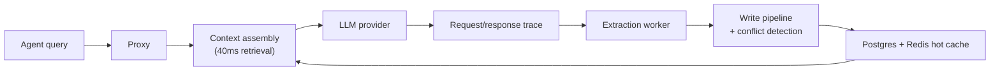

<Callout type="note" title="Phase 3 architecture">
  This post describes the **planned memory system** in [Phase 3 — Memory Engine and Operator Platform](/roadmap/phase-3-memory-engine). It is not live in production yet. Phase 1 shipped auth + proxy; Phase 2 adds provider forwarding. Memory services arrive in Phase 3.
</Callout>

## 1. Introduction: Why AI agents need a memory

In the current landscape of AI development, most agents suffer from **context loss**. Without a persistent memory system, every interaction effectively starts from a blank slate. The agent — the central entity coordinating these interactions — loses track of your preferences and past decisions, eventually exhibiting contradictory behavior as the conversation exceeds its short-term focus window.

IBEX transforms the agent from a forgetful calculator into a consistent, learning system. By providing a persistent memory lifecycle, IBEX ensures that knowledge is not merely stored but **refined and retrieved** to maintain a stable personality and expertise.

A persistent memory system provides three significant benefits:

- **Cross-session learning** — Knowledge gained in one interaction is preserved and available for all future sessions.
- **Behavioral consistency** — The agent maintains a stable personality by remembering past decisions and patterns.
- **Automated context management** — The system intelligently selects the most relevant information, removing the burden from the developer.

Before a thought can guide an agent's next move, it must first be born into the system through the extraction entry point.

## 2. Phase 1: Birth and extraction (the entry point)

Memories enter the IBEX system through two primary channels: manual creation via `POST /v1/memories` or automated **memory extraction**. Critically, extraction is **asynchronous** — it runs via background workers and does not block the critical path of the agent's response.

To keep the system organized, every memory is classified into one of five categories:

| Category | Definition |
| --- | --- |
| **Factual** | Stable, objective truths — e.g. "The user's database is PostgreSQL." |
| **Preference** | Subjective likes or dislikes — e.g. "The user prefers dark mode." |
| **Behavioral** | Patterns of interaction — e.g. "The user prefers concise answers." |
| **Episodic** | Records of specific past events — e.g. "We fixed the login bug in Session X." |
| **Procedural** | Instructions on how to do something — e.g. "To deploy, run steps A, then B." |

The automated memory extraction worker follows a three-step process:

<Steps>
  <Step title="Analyze">
    The worker examines the request/response trace from the proxy.
  </Step>
  <Step title="Classify">
    It determines whether the information is learnable based on a classification model.
  </Step>
  <Step title="Extract">
    It uses an LLM to distill structured facts or patterns into memory records.
  </Step>
</Steps>

See [Goal 3.4 — Memory extraction worker](/roadmap/phase-3-memory-engine/goals#goal-34-memory-extraction-worker) for the milestone breakdown.

Once a memory is born, it must pass through a refinery to ensure quality and uniqueness.

## 3. Phase 2: The refinery (deduplication and conflict detection)

The **memory write pipeline** acts as a refinery. It ensures the system does not store the same thought twice, preventing data bloat and agent confusion. Like extraction, this phase is asynchronous and non-blocking.

### The three stages of deduplication

| Stage | Mechanism | Why it matters |
| --- | --- | --- |
| **Exact** | Content hash | Instantly rejects identical text to save processing power |
| **Near-duplicate** | Vector similarity | Catches sentences that mean the same thing in different words |
| **Semantic** | Deep check | Optional, expensive analysis for maximum conceptual uniqueness |

Even unique memories might clash with existing knowledge. The **conflict detection worker** manages these relationships with four conflict types:

- **Contradiction** — New info says "A," but old info says "Not A."
- **Overlap** — New and old info cover identical ground.
- **Supersedes** — New info is a more up-to-date version of the old.
- **Specializes** — New info provides a detailed refinement of a general rule.

After being cleared for storage, refined memories move to their permanent homes in the architecture.

## 4. Phase 3: The vault and the desk (storage architecture)

IBEX uses a **dual-storage strategy** to balance long-term security with extreme performance.

- **PostgreSQL (the vault)** — The permanent source of truth. Using the pgvector extension, it stores memories as mathematical coordinates for semantic search. Row-Level Security (RLS) physically isolates one organization's data from another.
- **Redis Stack (the desk)** — The high-speed hot cache. Beyond rate limiting, it uses RedisBloom bloom filters for fast security rejections — invalidating tokens or rejecting unauthorized requests in microseconds.

**The practical split:** PostgreSQL provides deep, secure searching across millions of records. Redis Stack provides the sub-millisecond response times required for a fluid agent experience. Think of it as a massive library (Postgres) versus the specific notes open on your desk (Redis).

Once stored, the system must retrieve these memories with surgical precision when the agent needs them.

## 5. Phase 4: The call to action (retrieval and ranking)

When an agent receives a query, it performs **semantic search**. Natural language is converted into a vector embedding, and the system finds memories mathematically near that query in embedding space.

Because IBEX targets **under 20ms p99 proxy overhead**, retrieval must be lightning-fast. To find the best candidates, IBEX applies a composite memory ranking formula:

```
Score = (Relevance × 0.40) + (Recency × 0.25) + (Usefulness × 0.20)
      + (Confidence × 0.10) + (Frequency × 0.05)
```

| Weight | Signal | Role |
| --- | --- | --- |
| **0.40** | Relevance | How well the memory matches the current topic |
| **0.25** | Recency | Prioritizing new information over stale data |
| **0.20** | Usefulness | Based on previous user feedback |
| **0.10** | Confidence | The system's trust in the data's accuracy |
| **0.05** | Frequency | How often the memory is needed |

This composite score ensures the AI receives the most helpful, fresh, and trusted context — not just a keyword match. The final step is packing these results into a format the model can digest.

## 6. Phase 5: The final assembly (context injection)

The **context assembly engine** works within a strict **40ms parallel retrieval deadline**. It must manage a **token budget** — the limited space in an model's context window. To reduce the "lost in the middle" phenomenon (where LLMs ignore information buried in the center of a prompt), the engine uses a fixed priority order:

<Steps>
  <Step title="Directive">
    Core behavior instructions for the agent.
  </Step>
  <Step title="History">
    Recent conversation turns.
  </Step>
  <Step title="Memories">
    Within this group, procedural memories (how-to) are prioritized over factual memories so the agent follows instructions even when the window is crowded.
  </Step>
  <Step title="Tools">
    Available technical capabilities.
  </Step>
</Steps>

The result is a normalized request ready for the LLM provider (OpenAI in Phase 2, multi-provider in Phase 4). This entire journey is protected by a rigorous safety framework.

## 7. The safety net: Multi-tenancy and privacy

IBEX is built on **absolute grounding** with a **fail-closed** security posture. If a security check — like auth validation — cannot be completed or times out, the system denies access by default. This is the same principle that governs [Phase 1 proxy auth](/blog/phase-1-launch).

**Quarantined memories** are those flagged for PII detection or prompt injection risk. They are stored but blocked from retrieval until a human reviewer clears them.

### Safety at every layer

| Layer | Isolation mechanism | Purpose |
| --- | --- | --- |
| **Database** | Row-Level Security (RLS) | Hard isolation of tenant data at the engine level |
| **Cache** | Key namespacing | Prevents cross-tenant leaks in the hot data cache |
| **Search** | `org_id` vector filtering | Ensures search results are strictly restricted to the owning organization |

## 8. Conclusion: The lifecycle loop

The memory lifecycle is a continuous loop: an LLM response generates a **trace**, which triggers asynchronous **extraction**, creating a new **memory** that is refined and stored to inform the very next **retrieval**.



Three critical insights:

1. **Memory is a pipeline** — Storing data is easy; the intelligence lies in asynchronous refinement, deduplication, and conflict resolution.
2. **Latency is the constraint** — With a 20ms overhead target, every architecture choice — from Redis bloom filters to composite ranking — is optimized for speed.
3. **Security is fail-closed** — Multi-tenancy is not a feature; it is a foundation enforced through RLS and mandatory `org_id` filtering.

### Go deeper

<CardGrid>
  <DocCard title="Phase 3 goals" href="/roadmap/phase-3-memory-engine/goals" description="Acceptance criteria for schema, embedding, memory service, worker, context assembly, API, and dashboard." iconName="Flag" category="guide" />
  <DocCard title="Request lifecycle" href="/docs/architecture/request-lifecycle" description="End-to-end proxy flow including context retrieval deadlines." iconName="GitBranch" category="guide" />
  <DocCard title="Core concepts" href="/docs/getting-started/concepts" description="Organizations, agents, memories, directives, and sessions." iconName="BookOpen" category="guide" />
  <DocCard title="Services overview" href="/docs/architecture/services" description="Memory, context, embedder, worker, and API service roles." iconName="Boxes" category="guide" />
</CardGrid>

The journey of a thought does not end at storage. It ends when that thought — ranked, bounded, and tenant-safe — shapes the agent's next answer.
