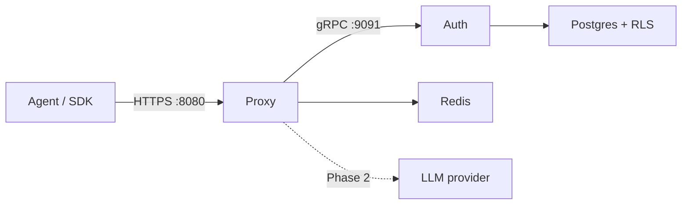

Most LLM proxies start by forwarding HTTP. IBEX Harness starts by earning trust.

Phase 1 is complete. Before we call OpenAI, assemble context, or store a single memory, the platform validates every bearer token, verifies agent identity against the organization in the URL path, normalizes request bodies into a stable internal shape, and rejects traffic that fails any check. Chat routes return `501 PROVIDER_NOT_CONFIGURED` on purpose — that response means auth, agent verification, and routing succeeded; provider forwarding ships in Phase 2.

This post explains what Phase 1 built, why we sequenced it this way, and how to run it locally in five minutes.

## The problem Phase 1 solves

Persistent memory only matters if the proxy underneath it is secure, multi-tenant, and observable. A memory system bolted onto an unauthenticated proxy would leak context across organizations and fail the moment load spikes.

Phase 1 delivers the **platform layer**:

| Capability | Why it blocks everything else |
| --- | --- |
| Durable schema + migrations | Tokens, orgs, agents, and permissions need a source of truth |
| gRPC auth validation | Every proxy request must resolve org, agent, and permission bitmap |
| Fail-closed middleware | Auth outage or timeout denies access — never silent passthrough |
| Request normalization | Provider adapters in Phase 2 consume one internal struct, not raw JSON |
| Rate limiting + correlation IDs | Production traffic needs budgets and traceable requests from day one |

Phase 1 is deliberately **not** an LLM product yet. It is the hardened skeleton everything else attaches to.

## What shipped

Twenty-two milestones across auth, proxy, observability, developer experience, and a security integration test suite. The highlights:

### Auth service

- **Postgres migrations** for organizations, users, agents, and API tokens with Row-Level Security
- **gRPC `ValidateToken`** with Argon2id verification and a permission bitmap returned to callers
- **Token lifecycle APIs** — create, list, and revoke organization PATs
- Accepted ADRs for [migration strategy](/docs/adr/0005-postgres-migration-strategy) and [auth proto design](/docs/adr/0006-auth-proto-contract)

### Proxy middleware chain

Every request to `/v1/orgs/{org_id}/agents/{agent_id}/...` passes through a ordered pipeline before handler logic runs:

<Steps>
  <Step title="Bearer extraction">
    Missing or malformed `Authorization` headers fail immediately with a stable error envelope.
  </Step>
  <Step title="gRPC auth validation">
    The proxy calls auth with a 50ms deadline. Timeout or transport failure → `503` fail-closed.
  </Step>
  <Step title="Agent identity verification">
    The token's agent must match the agent in the URL path. Cross-agent token reuse is rejected.
  </Step>
  <Step title="Rate limiting">
    Redis-backed RPM budgets per organization. Redis down → fail-open with logging (documented tradeoff).
  </Step>
  <Step title="Body normalization">
    OpenAI-compatible chat JSON parses into an internal struct. Malformed bodies return `400` with field-level detail.
  </Step>
</Steps>

See the full spec: [Milestone 1.2.5 — proxy agent identity verification](/roadmap/phase-1-core-platform/milestones/1.2.5-proxy-agent-identity-verification).

### Observability and operations

- OpenTelemetry tracer provider registered across auth and proxy
- Prometheus metrics via the official Go client
- Shared structured logger package
- Health check contract for dependency readiness (`/healthz`, `/readyz`)

### Security gate

[Milestone 1.5.1](/roadmap/phase-1-core-platform/milestones/1.5.1-security-integration-test-suite) is the explicit Phase 1 exit gate: a cross-tenant security matrix covering token validation, agent mismatch, permission boundaries, and rate-limit behavior. Phase 1 did not ship without it.

## Architecture at a glance

| Component | Phase 1 status | Default port |
| --- | --- | --- |
| Proxy | Running — auth, validate, rate limit, normalize | HTTP 8080 |
| Auth | Running — token CRUD + validation | gRPC 9091, HTTP 8081 |
| Postgres | Required — schema + RLS | 5432 |
| Redis | Required — rate limits | 6379 |

## What a successful request looks like today

Follow the [Quickstart](/docs/getting-started/quickstart): boot Compose, run migrations, start auth and proxy, issue a PAT, then POST to the chat completions route.

A **`501 PROVIDER_NOT_CONFIGURED`** response is success for Phase 1. It confirms:

1. Your bearer token validated over gRPC
2. The agent in the URL matched the token
3. Rate limiting and body parsing ran
4. The handler reached the provider slot — which is intentionally empty until Phase 2

<Callout type="warning" title="Honest scope">
  Do not expect LLM responses, memory writes, or dashboard flows. JWT sessions, Python services, ClickHouse traces, and context assembly are Phase 2+ work. Live inventory: [current state](/roadmap/current-state).
</Callout>

## Design choices worth knowing

**Fail-closed auth.** If validation cannot complete within the deadline, the proxy returns `503`. We chose reliability of tenant isolation over best-effort forwarding.

**Org-scoped URLs.** Every proxy route embeds `org_id` and `agent_id`. The auth layer cross-checks both against the token — not just "is this token valid?" but "is this token valid *for this agent in this org?*"

**Stable error envelope.** All proxy errors share one JSON shape with `code`, `message`, `request_id`, and optional field errors. Integrators can branch on `code` without parsing prose.

**Permission bitmap.** Tokens carry a compact capability set returned from auth. Phase 2 provider routing and Phase 3 memory APIs will gate features on these bits — the contract is fixed in Phase 1.

## What's next

| Phase | Focus |
| --- | --- |
| [Phase 1.5](/roadmap/phase-1-5-docs-site) | Public docs site, roadmap, ADRs — [now live](/blog/docs-site-and-roadmap-launch) |
| [Phase 2](/roadmap/phase-2-single-provider) | First LLM provider adapter, session store, directive resolver, ClickHouse traces |
| [Phase 3](/roadmap/phase-3-memory-engine) | Memory engine, context assembly, operator dashboard |

Track delivery on the [roadmap hub](/roadmap). For the memory story ahead of implementation, read [The Journey of a Thought](/blog/ibex-memory-lifecycle-map).

## Get started

<CardGrid>
  <DocCard title="Quickstart" href="/docs/getting-started/quickstart" description="Boot the stack and send your first proxied request in ~5 minutes." iconName="Zap" category="tutorial" />
  <DocCard title="Security overview" href="/docs/security/overview" description="Fail-closed auth, RLS, and tenant isolation." iconName="Shield" category="guide" />
  <DocCard title="Phase 1 exit audit" href="/roadmap/phase-1-core-platform/phase1-exit-audit" description="Gap analysis and completion evidence." iconName="FileCode" category="reference" />
  <DocCard title="Chat completions API" href="/docs/api-reference/chat-completions" description="Proxy route shape and Phase 1 501 behavior." iconName="Waypoints" category="reference" />
</CardGrid>

Phase 1 is the floor. Everything IBEX promises — learning agents, sub-20ms overhead, multi-tenant memory — builds on a proxy that refuses to forward untrusted traffic. That floor is in place.
