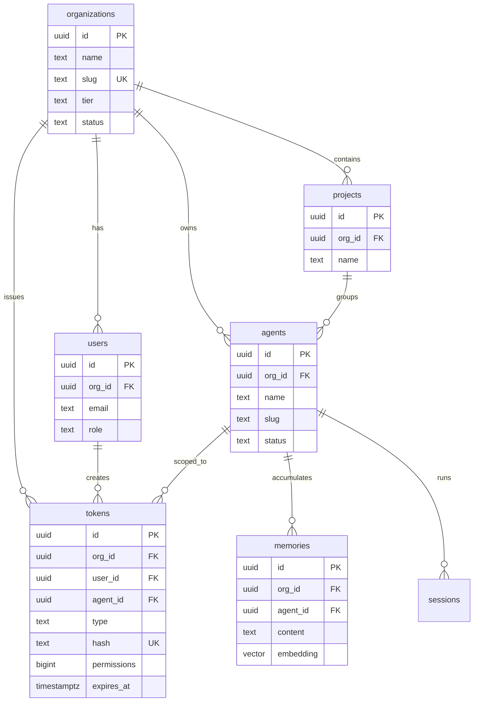

Every customer-facing entity in IBEX Harness is scoped to an **organization**. Agents and tokens belong to exactly one org; the proxy enforces that the org in the URL path matches the org embedded in the validated token. Row-Level Security (RLS) on `ibex_core` tables provides a database-level backstop so application bugs cannot leak cross-tenant rows.

<Callout type="note" title="Phase 1 migrated tables">
  Migrations through milestone 1.1.7 create `ibex_core.organizations`, `ibex_core.users`, `ibex_core.agents`, and `ibex_core.tokens` with RLS policies. Memory, sessions, directives, and billing tables are specified below but not yet applied — run `make db-migrate` after compose boot for the current subset.
</Callout>

## Entity hierarchy

<Steps>
  <Step title="Organization">
    Root tenant. Owns agents, tokens, rate-limit buckets, and billing boundaries. Identified by UUID; human-readable `slug` for URLs and dashboards.
  </Step>
  <Step title="Project (reserved)">
    Logical grouping inside an org for teams or environments. The schema reserves project boundaries; Phase 1 proxy paths use `org_id` only. Project scoping arrives with dashboard and memory features.
  </Step>
  <Step title="User">
    Human operator who issues PATs and manages agents. Role: `owner`, `admin`, `member`, or `viewer`. SSO and MFA fields exist in the full schema; Phase 1 uses the column subset from migration `000006`.
  </Step>
  <Step title="Agent">
    Autonomous actor that calls the proxy. Identified by `X-IBEX-Agent-ID` on each request. Unique `(org_id, slug)` constraint; status: `active`, `paused`, `suspended`, or `archived`.
  </Step>
  <Step title="Token">
    Personal Access Token (PAT) or org-scoped credential. Stored as Argon2id hash — plaintext shown once at creation. Carries a 64-bit permission bitmap; never log the raw secret.
  </Step>
</Steps>

## Core ER diagram (Phase 1 + planned)



Solid relationships reflect migrated Phase 1 tables. `projects`, `memories`, and `sessions` are planned — shown for integrators designing agent layouts ahead of memory milestones.

## Key fields

<ParamTable
  params={[
    {
      name: "organizations.id",
      type: "UUID",
      required: true,
      description: "Tenant root. Propagated from validated token; never accepted from request body on protected routes.",
    },
    {
      name: "organizations.slug",
      type: "string",
      required: true,
      description: "URL-safe identifier (`^[a-z0-9-]+$`). Unique across active orgs.",
    },
    {
      name: "agents.org_id",
      type: "UUID",
      required: true,
      description: "Must match token org_id. Cross-org agent access returns 403 PERMISSION_DENIED.",
    },
    {
      name: "tokens.hash",
      type: "string",
      required: true,
      description: "Argon2id hash of PAT wire value (`ibex_pat_...`). Indexed for validation on every request.",
    },
    {
      name: "tokens.permissions",
      type: "int64 (bitmap)",
      required: true,
      description: "64-bit permission set. Proxy chat routes require ProxyChatCompletion bits per ADR-0009.",
    },
    {
      name: "tokens.agent_id",
      type: "UUID",
      required: false,
      description: "Optional scope binding. When set, token is limited to that agent within the org.",
    },
  ]}
/>

## Row-Level Security

RLS policies on every `ibex_core` table with `org_id` compare against `current_setting('app.current_org_id')`. The auth service sets this from the validated token before queries execute:

```sql
SET LOCAL app.current_org_id = '{org_id_from_token}';

-- Example policy on agents
CREATE POLICY agents_isolation ON ibex_core.agents
    USING (org_id = current_setting('app.current_org_id', true)::UUID);
```

Even if application code omits an `org_id` filter, Postgres rejects cross-tenant reads. See [Multi-tenant RLS](/docs/auth/multi-tenant-rls).

## Redis key namespacing

Cache and rate-limit keys always include `org_id` as the second segment:

```text
ratelimit:{org_id}:minute
{org_id}:hot_memories:{agent_id}
auth:token:{sha256_hash}
```

This mirrors the database isolation contract at the cache layer.

## Planned tables (not migrated yet)

| Table | Schema | Purpose |
| --- | --- | --- |
| `memories` | `ibex_core` | Vector-backed agent memory with dedup and conflict tracking |
| `sessions` / `checkpoints` | `ibex_core` | Session lifecycle and crash recovery |
| `directives` / `directive_versions` | `ibex_core` | Versioned agent instructions |
| `audit_log` | `ibex_audit` | Append-only compliance log |
| `inference_traces` | ClickHouse | Per-request analytics (90-day TTL) |

## Local seed data

```bash
make compose-dev-up
make db-migrate
make db-seed
```

Use the printed org, agent, and PAT values for proxy probes. See [Org and project model](/docs/auth/org-project-model) and [Issuing API keys](/docs/auth/issuing-api-keys).

## Related

- [Auth overview](/docs/auth/overview)
- [Glossary](/docs/glossary)
- [ADR-0014: Migration sequencing](/docs/adr/0014-core-domain-migration-sequencing)
