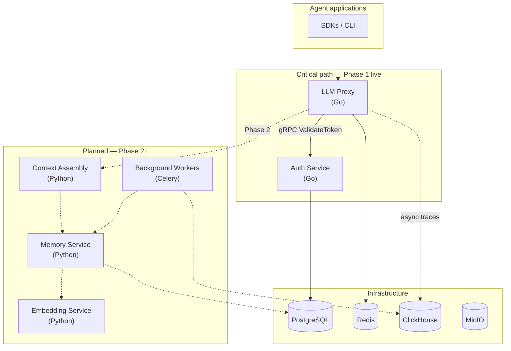

import { Brain, Gauge, Shield, Waypoints } from "lucide-react";

IBEX Harness is a distributed platform for persistent agent memory, intelligent context assembly, and behavioral consistency. Agent applications call a low-latency [LLM proxy](/docs/proxy/overview); the proxy authenticates every request through the [auth service](/docs/auth/overview) and (in later phases) injects memory and directives before forwarding to provider APIs.

<Callout type="note" title="Phase 1 honest scope">
  **Live today:** Go proxy and auth services, Postgres schema with RLS, Redis rate limiting, gRPC token validation. **Not yet live:** chat completion forwarding (returns `501 PROVIDER_NOT_CONFIGURED`), memory service, context assembly, Python workers, and dashboard. Treat diagrams below as the target architecture; dashed nodes are planned.
</Callout>

## System diagram

The **critical path** is every LLM request: authenticate, enforce limits, assemble context, call the provider, stream the response. Target proxy overhead is under 20ms (p99) excluding provider latency. Memory extraction, drift detection, and analytics run asynchronously and must never block the agent's inference call.

## Design principles

<FeatureGrid
  features={[
    {
      icon: Gauge,
      title: "Performance first",
      description:
        "The proxy and context assembly pipeline are optimized for millisecond budgets. Auth validation has a 50ms gRPC deadline; context retrieval targets a 40ms parallel deadline in Phase 2.",
    },
    {
      icon: Shield,
      title: "Security by default",
      description:
        "org_id comes from the verified token, never the request body. Postgres RLS, Redis key namespacing, and permission bitmaps enforce isolation at every layer. Cross-tenant misses return 403, not 404.",
    },
    {
      icon: Waypoints,
      title: "Fail gracefully",
      description:
        "Auth unreachable → fail closed (503). Context assembly timeout → directive-only context. Memory slow → hot-cache only. Rate limit Redis down → conservative fail-open with audit.",
    },
    {
      icon: Brain,
      title: "Observable everything",
      description:
        "Structured JSON logs with request_id, Prometheus metrics on bounded labels, and OpenTelemetry traces across HTTP, gRPC, Redis, and database boundaries.",
    },
  ]}
/>

## What runs synchronously vs async

<ProcessSteps
  steps={[
    {
      title: "Synchronous (blocks the agent)",
      description:
        "Token validation, agent identity check, rate limiting, context retrieval, LLM provider call, and response streaming. These steps define user-perceived latency.",
    },
    {
      title: "Asynchronous (never blocks)",
      description:
        "Trace emission to ClickHouse, memory extraction jobs, behavioral fingerprinting, drift alerts, billing counters, and notification delivery. Failures here degrade analytics, not inference.",
    },
    {
      title: "Phase 1 today",
      description:
        "Only the first three synchronous steps are live: validate token, verify agent, rate limit. Provider forwarding and context injection return 501 until Phase 2.",
    },
  ]}
/>

## Latency budgets

| Operation | Budget |
| --- | --- |
| Auth `ValidateToken` gRPC | 50ms |
| Redis rate limit check | 5ms |
| Full proxy overhead (excl. LLM) | 20ms p99 |
| Context assembly (Phase 2) | 50ms p95 |

## Related

- [Services](/docs/architecture/services) — which components are live vs planned
- [Request lifecycle](/docs/architecture/request-lifecycle) — step-by-step proxy flow
- [Glossary](/docs/glossary) — PAT, RLS, org_id, and other terms
