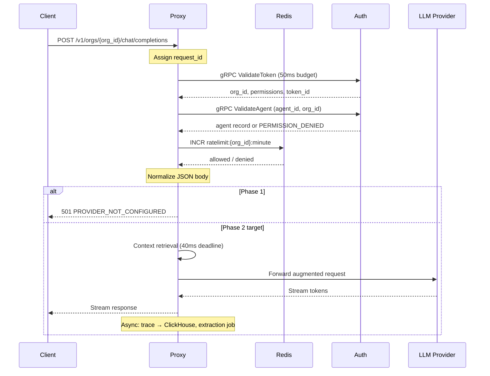

A protected LLM request enters the proxy as an OpenAI-compatible HTTP call. Before any provider handoff, the proxy validates credentials, confirms agent identity, and enforces rate limits. In Phase 1 the pipeline stops after body normalization and returns `501 PROVIDER_NOT_CONFIGURED` — a successful 501 means auth and agent checks passed.

<Endpoint
  method="POST"
  path="/v1/orgs/{org_id}/chat/completions"
  description="OpenAI-compatible chat completions. Phase 1 returns 501 after auth succeeds; Phase 2 forwards to a registered provider adapter."
/>

## Required headers

| Header | Required | Notes |
| --- | --- | --- |
| `Authorization` | Yes | `Bearer` + PAT (`ibex_pat_...`) |
| `X-IBEX-Agent-ID` | Yes | UUID; must belong to `{org_id}` in path |
| `Content-Type` | Yes (POST) | `application/json` |
| `X-Request-ID` | No | UUID v7; generated if absent |

## Lifecycle steps

<ProcessSteps
  steps={[
    {
      title: "Request ID assigned",
      description:
        "Middleware assigns or validates X-Request-ID (UUID v7) and injects it into the request context for logs, metrics, and gRPC metadata propagation.",
    },
    {
      title: "Bearer token validated",
      description:
        "Proxy calls auth ValidateToken over gRPC with a 50ms deadline. On success, org_id, permissions, and token_id attach to context. Missing token → 401; auth down → 503 fail-closed per ADR-0011.",
    },
    {
      title: "Agent identity verified",
      description:
        "Proxy requires X-IBEX-Agent-ID and confirms the agent belongs to the org in the URL. Cross-org or unknown agent → 403 before the body is read.",
    },
    {
      title: "Rate limit checked",
      description:
        "Redis sliding-window counter keyed by org_id. Exceeded → 429 with Retry-After. Redis unavailable → fail-open with conservative local limits and audit warning.",
    },
    {
      title: "Body normalized",
      description:
        "JSON parsed and validated against the OpenAI chat schema. Malformed input → 400 with stable error envelope including request_id.",
    },
    {
      title: "Provider handoff (Phase 2+)",
      description:
        "Context assembly, memory injection, and streaming forward to the LLM provider. Phase 1 stops here with 501 PROVIDER_NOT_CONFIGURED.",
    },
  ]}
/>

## Sequence diagram



Dashed Phase 2 steps (context retrieval, provider streaming, async jobs) are specified in engineering docs but not executed in the current release.

## Phase 1 probe

```bash
curl -s -w "\nHTTP %{http_code}\n" \
  -X POST "http://localhost:8080/v1/orgs/${IBEX_DEV_ORG_ID}/chat/completions" \
  -H "Authorization: Bearer ${IBEX_DEV_TOKEN}" \
  -H "X-IBEX-Agent-ID: ${IBEX_DEV_AGENT_ID}" \
  -H "Content-Type: application/json" \
  -d '{"model":"gpt-4o","messages":[{"role":"user","content":"ping"}]}'
```

Expected: HTTP **501** with `PROVIDER_NOT_CONFIGURED` — confirms token validation, agent verify, rate limiting, and normalization all succeeded.

## Error mapping

| Condition | HTTP | Code |
| --- | --- | --- |
| Missing `Authorization` | 401 | `MISSING_TOKEN` |
| Invalid or revoked PAT | 401 | `INVALID_TOKEN` |
| Agent not in org / path mismatch | 403 | `INSUFFICIENT_PERMISSIONS` |
| Rate limit exceeded | 429 | `RATE_LIMIT_EXCEEDED` |
| Auth gRPC timeout or unavailable | 503 | `SERVICE_DEGRADED` |
| No provider configured | 501 | `PROVIDER_NOT_CONFIGURED` |

Full envelope: [API errors](/docs/api-reference/errors).

## Target path (Phase 2+)

Once provider adapters and context assembly ship, the synchronous path extends:

1. **Parallel context retrieval** (40ms deadline) — directive from Redis, hot memories, recent session history
2. **Context assembly gRPC** — rank and pack memories within model token budget
3. **Provider forward** — augment messages, stream response to client while accumulating for async extraction
4. **Async side effects** — ClickHouse trace, memory extraction job, session heartbeat update

Auth validation in Phase 2 may add an optional bloom filter + LRU cache ([ADR-0011](/docs/adr/0011-proxy-auth-client) deferral record); Phase 1 always calls gRPC.

## Architecture decisions

| Topic | ADR |
| --- | --- |
| Proxy → auth gRPC client | [ADR-0011](/docs/adr/0011-proxy-auth-client) |
| Token validation contract | [ADR-0007](/docs/adr/0007-auth-token-validation) |
| Permission bitmap | [ADR-0009](/docs/adr/0009-permission-bitmap) |
| Rate limit skeleton | [ADR-0015](/docs/adr/0015-proxy-rate-limit-skeleton) |
| Agent identity verification | [ADR-0016](/docs/adr/0016-agent-identity-verification) |
| Request ID propagation | [ADR-0017](/docs/adr/0017-request-id-strategy) |

## Related

- [Proxy overview](/docs/proxy/overview)
- [Proxy authentication](/docs/proxy/authentication)
- [Auth overview](/docs/auth/overview)
- [Glossary](/docs/glossary)
