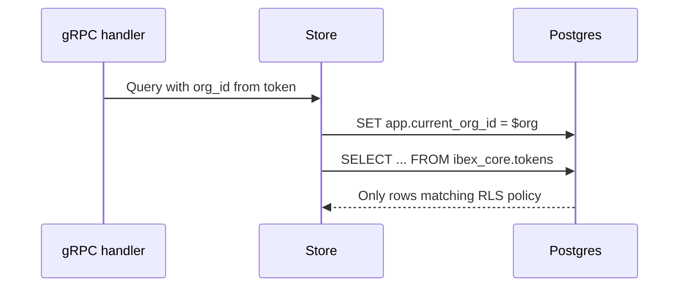

Postgres row-level security (RLS) ensures each organization's data is invisible to other tenants, even if application code regresses. Policies live in the `ibex_core` schema and ship with versioned migrations under `infra/migrations/` ([ADR-0005](/docs/adr/0005-postgres-migration-strategy)).

RLS is one layer in a defense-in-depth model — auth queries **still** include explicit `org_id` filters. See [Tenant isolation](/docs/security/tenant-isolation).

<Callout type="note" title="Defense in depth">
  Application org checks + RLS + cross-tenant `403` responses (not `404`) together prevent enumeration and data leaks. A single missing check should not compromise isolation.
</Callout>

## How session org context works



Auth sets `app.current_org_id` (or equivalent session variable) before every tenant-scoped query. Policies reference this setting — queries without it see zero rows or fail closed depending on table policy.

## Protected tables (Phase 1)

| Table | Isolation policy | Phase 1 usage |
| --- | --- | --- |
| `ibex_core.organizations` | Org-scoped reads | Tenant root |
| `ibex_core.users` | Org-scoped membership | Token audit |
| `ibex_core.agents` | Org-scoped CRUD | Agent verification |
| `ibex_core.tokens` | Org-scoped CRUD | PAT hash storage |

Future tables (memories, sessions, directives) will follow the same pattern before their services launch.

## Migration workflow

<Steps>
  <Step title="Start Postgres">
    `make compose-dev-up` — dev DSN on port 5432.
  </Step>
  <Step title="Apply migrations">
    `make db-migrate` — idempotent; records version in schema_migrations.
  </Step>
  <Step title="Optional seed">
    `make db-seed` — dev rows only; never on staging/production.
  </Step>
  <Step title="CI parity">
    Every PR runs `db-migrate-smoke` against ephemeral Postgres.
  </Step>
</Steps>

Roll back one step in dev only: `make db-migrate-down`. Check version: `make db-version`.

## Verify RLS is enabled

```bash
psql "$POSTGRES_DSN" -c \
  "SELECT tablename, rowsecurity FROM pg_tables WHERE schemaname = 'ibex_core';"
```

Expected: `rowsecurity = t` on core tenant tables.

Inspect policies:

```sql
SELECT polname, polcmd, polroles::regrole[]
FROM pg_policy p
JOIN pg_class c ON p.polrelid = c.oid
JOIN pg_namespace n ON c.relnamespace = n.oid
WHERE n.nspname = 'ibex_core';
```

## Cross-tenant denial contract

When org A requests org B's agent or token:

| Layer | Behavior |
| --- | --- |
| Proxy | `403 AGENT_NOT_AUTHORIZED` or `PATH_ORG_MISMATCH` |
| gRPC | `PermissionDenied` — not `NotFound` |
| Store | `(nil, nil)` for wrong-org row — mapped to 403 |
| RLS | Zero rows returned even if WHERE clause regresses |

Ambiguous denials prevent attackers from learning whether a UUID exists in another org. Audit logs record cross-tenant attempts in production configurations.

## Redis and application namespacing

RLS protects Postgres only. Other stores namespace by org at the key level:

```text
ratelimit:{org_id}:rpm:{minute}
auth:token:{sha256_hash}   # hash scoped; org in cached payload
```

ClickHouse (Phase 2+ traces) has no RLS — every query must filter `org_id` explicitly.

## Testing isolation

```bash
make compose-test-up
go test -tags=integration ./services/auth/...
go test -tags=integration -run '^TestSecurity_' ./services/proxy/...
```

Auth store integration tests use real Postgres (testcontainers or compose-test on port 5433). Windows developers: set `$env:POSTGRES_TEST_DSN` to dev Postgres on 5432 if preferred.

<Callout type="warning" title="Never disable RLS in production">
  Local debugging with superuser bypass is acceptable; production roles must not hold `BYPASSRLS`.
</Callout>

## Policy evolution rules

From ADR-0005:

- New tenant tables ship with RLS enabled in the **same migration** that creates the table
- Policy changes require integration tests proving cross-org denial
- Breaking policy changes need an ADR and compatibility plan

## Related

- [Org and project model](/docs/auth/org-project-model) — entity relationships
- [Auth overview](/docs/auth/overview) — who sets session org context
- [Security overview](/docs/security/overview) — threat model
- [ADR-0005](/docs/adr/0005-postgres-migration-strategy) — migration sequencing
- [ADR-0014](/docs/adr/0014-core-domain-migration-sequencing) — users and agents schema
