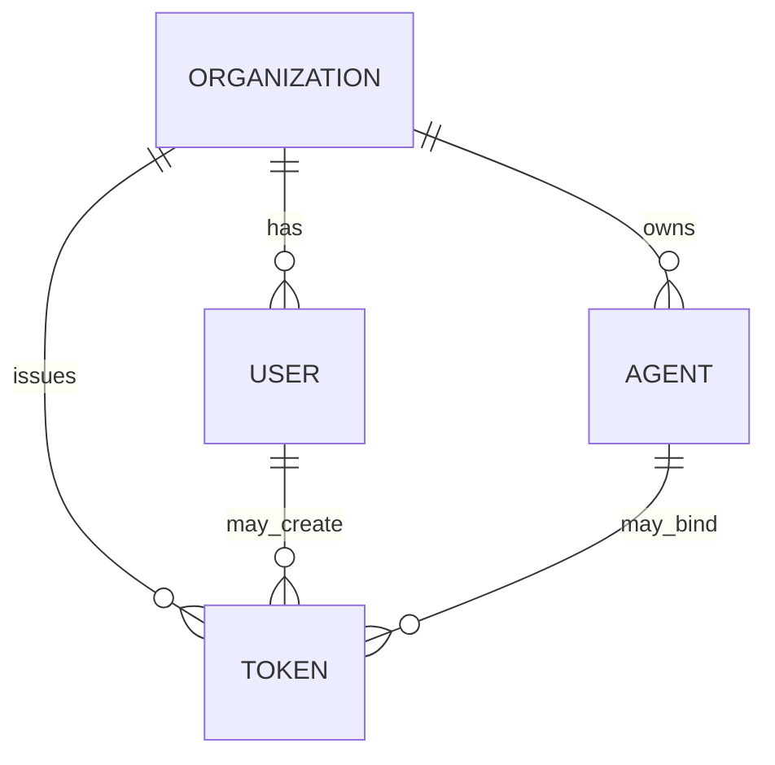

IBEX Harness scopes all runtime identity to an **organization**. Agents belong to exactly one org; tokens are issued per org and encode a permission bitmap for that tenant. The proxy derives `org_id` from the validated PAT — never from request body fields.

<Callout type="note" title="Projects in Phase 1">
  The schema reserves project boundaries for later phases. Phase 1 proxy paths use org scope only — project-scoped URLs and memory isolation arrive with dashboard and memory services.
</Callout>

## Entity hierarchy



<Steps>
  <Step title="Organization">
    Top-level tenant. Owns agents, tokens, and rate-limit buckets. Table: `ibex_core.organizations`.
  </Step>
  <Step title="User">
    Human operator (Phase 1 subset). Linked to org membership for token issuance audit. Table: `ibex_core.users`.
  </Step>
  <Step title="Agent">
    Autonomous actor that calls the proxy. Identified by `X-IBEX-Agent-ID` on every protected request. Table: `ibex_core.agents`.
  </Step>
  <Step title="Token">
    PAT credential with permission bitmap, bound to org (and optionally user/agent). Table: `ibex_core.tokens`.
  </Step>
</Steps>

Full schema reference: [Data model](/docs/architecture/data-model).

## Runtime binding rules

| Rule | Enforcement |
| --- | --- |
| Token org is authoritative | Proxy middleware after `ValidateToken` |
| Agent must belong to token org | `ValidateAgent` gRPC + store WHERE clause |
| Path org must match token org | `/v1/orgs/{org_id}/auth-probe` only |
| Cross-tenant access | `403` — never `404` |

Chat completions use `POST /v1/chat/completions` with org from the token — there is no `{org_id}` path segment on chat. Diagnostic org probes exist to verify path binding for integrators building org-prefixed URLs in later phases.

## Permission and agent headers

Every protected proxy request carries:

```
Authorization: Bearer ibex_pat_<uuid>_<secret>
X-IBEX-Agent-ID: <agent-uuid>
```

The agent UUID must reference an **active** row in `ibex_core.agents` where `agents.org_id` equals the token's org. Suspended agents return `403 AGENT_SUSPENDED`.

## Seed data for local dev

```bash
make db-migrate
make db-seed
```

| Entity | Fixed UUID (dev seed) |
| --- | --- |
| Organization | `00000000-0000-0000-0000-000000000001` |
| Agent | `00000000-0000-0000-0000-000000000003` |
| Token | `00000000-0000-0000-0000-000000000004` |

`make db-seed` exports `IBEX_DEV_ORG_ID`, `IBEX_DEV_AGENT_ID`, and `IBEX_DEV_TOKEN` for smoke tests. Seed refuses non-local DSN hosts and `IBEX_ENV=production`.

## Projects (reserved)

The `ibex_core` schema includes hooks for project-scoped resources — memories, directives, and dashboard namespaces will attach to projects in Phase 3+. Phase 1 operators should:

- Issue one PAT per integration environment (dev/staging/prod org)
- Register one agent per autonomous service instance
- Avoid assuming project IDs exist in API paths yet

## Multi-tenant security layers

<ProcessSteps
  steps={[
    {
      title: 'HTTP middleware',
      description: 'Proxy extracts org_id from validated token; rejects path mismatches.',
    },
    {
      title: 'gRPC handler',
      description: 'Auth validates org_id in CreateToken/ValidateAgent requests.',
    },
    {
      title: 'Store layer',
      description: 'Every query includes org_id in WHERE clauses.',
    },
    {
      title: 'Postgres RLS',
      description: 'Session org context gates row visibility — see Multi-tenant RLS.',
    },
  ]}
/>

Defense-in-depth rationale: [Tenant isolation](/docs/security/tenant-isolation).

## Verify org binding

<CodeTabs>
  <CodeTab label="Matching org probe">
```bash
curl -s "http://localhost:8080/v1/orgs/${IBEX_DEV_ORG_ID}/auth-probe" \
  -H "Authorization: Bearer ${IBEX_DEV_TOKEN}" \
  -H "X-IBEX-Agent-ID: ${IBEX_DEV_AGENT_ID}"
```
  </CodeTab>
  <CodeTab label="Cross-org (expect 403)">
```bash
curl -s -w "\nHTTP %{http_code}\n" \
  "http://localhost:8080/v1/orgs/00000000-0000-0000-0000-000000000099/auth-probe" \
  -H "Authorization: Bearer ${IBEX_DEV_TOKEN}" \
  -H "X-IBEX-Agent-ID: ${IBEX_DEV_AGENT_ID}"
```
  </CodeTab>
</CodeTabs>

CI `security-integration` runs automated cross-tenant cases — no manual probing required for merge gates.

## Related

- [Multi-tenant RLS](/docs/auth/multi-tenant-rls) — database enforcement
- [Issuing API keys](/docs/auth/issuing-api-keys) — PAT lifecycle
- [Proxy authentication](/docs/proxy/authentication) — header contract
- [Concepts](/docs/getting-started/concepts) — integrator-oriented overview
