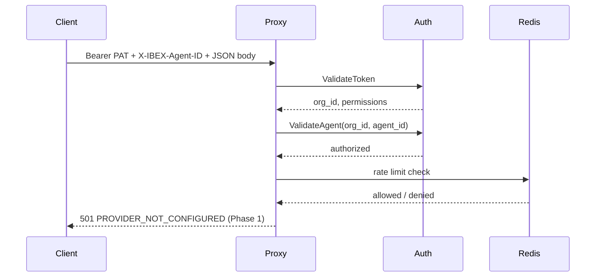

IBEX Harness separates **who** is calling (organization + agent), **what** they may do (permissions), and **where** requests go (proxy routing). Understanding these three axes is enough to integrate against Phase 1 — memory, context assembly, and provider forwarding build on the same identity model later.

<Callout type="note" title="Phase 1 scope">
  Phase 1 delivers auth + proxy only. Memory injection, vector search, and LLM provider forwarding are planned — not available. See [current state](/roadmap/current-state).
</Callout>

## Platform vocabulary

| Term | Meaning | Phase 1 |
| --- | --- | --- |
| **Organization** | Top-level tenant; owns agents, tokens, rate limits | Active — [glossary](/docs/glossary) |
| **Agent** | Autonomous actor inside an org; identified per request | Active |
| **PAT** | Personal Access Token — `ibex_pat_*` bearer credential | Active |
| **RLS** | Postgres row-level security isolating tenant rows | Active |
| **Proxy** | HTTP edge — auth, validate, rate limit, (future) forward | Active (no forward) |
| **Memory** | Persistent agent knowledge store | Not shipped |
| **Directive** | Behavioral instructions injected into LLM context | Not shipped |

## Core entities

<Steps>
  <Step title="Organization">
    Every token belongs to exactly one organization (`org_id`). Rate limits, RLS policies, and future billing boundaries scope per org. Table: `ibex_core.organizations`.
  </Step>
  <Step title="Agent">
    An agent is an autonomous actor inside an org. The proxy requires `X-IBEX-Agent-ID` on protected routes and validates it via auth gRPC `ValidateAgent`.
  </Step>
  <Step title="Token (PAT)">
    Clients authenticate with a Personal Access Token. The proxy calls `ValidateToken`; Argon2id verifies the secret server-side. Permissions are a 64-bit bitmap ([ADR-0009](/docs/adr/0009-permission-bitmap)).
  </Step>
  <Step title="User">
    Human operator linked to org membership. Phase 1 uses users for token audit trails; dashboard login is future work.
  </Step>
</Steps>

Entity relationships: [Org and project model](/docs/auth/org-project-model) and [Data model](/docs/architecture/data-model).

## Request path (Phase 1)



Full lifecycle documentation: [Request lifecycle](/docs/architecture/request-lifecycle).

## Required headers

Protected proxy routes require:

```
Authorization: Bearer ibex_pat_<uuid>_<secret>
X-IBEX-Agent-ID: <agent-uuid>
Content-Type: application/json   # POST bodies only
```

<CodeTabs>
  <CodeTab label="curl">
```bash
curl -X POST http://localhost:8080/v1/chat/completions \
  -H "Authorization: Bearer ${IBEX_DEV_TOKEN}" \
  -H "X-IBEX-Agent-ID: ${IBEX_DEV_AGENT_ID}" \
  -H "Content-Type: application/json" \
  -d '{"model":"gpt-4o","messages":[{"role":"user","content":"ping"}]}'
```
  </CodeTab>
  <CodeTab label="PowerShell">
```powershell
$headers = @{
  Authorization = "Bearer $env:IBEX_DEV_TOKEN"
  "X-IBEX-Agent-ID" = $env:IBEX_DEV_AGENT_ID
  "Content-Type" = "application/json"
}
Invoke-RestMethod -Uri http://localhost:8080/v1/chat/completions -Method POST -Headers $headers -Body '{"model":"gpt-4o","messages":[{"role":"user","content":"ping"}]}'
```
  </CodeTab>
</CodeTabs>

Phase 1 expected response: HTTP **501** with `PROVIDER_NOT_CONFIGURED` — auth, agent verify, rate limit, and validation succeeded.

<Callout type="tip" title="Org from token">
  Chat uses `POST /v1/chat/completions` without `{org_id}` in the URL. Tenant scope comes from the PAT, not the path.
</Callout>

## Permission model

Permissions are bitwise flags on the token. Integrators need at minimum:

| Permission | Required for |
| --- | --- |
| `ProxyChatCompletion` | Chat completion endpoint |
| `TokenCreate` | Issuing new PATs via gRPC |

Admin seed tokens include broader bits for local development. Production tokens should follow least privilege — [Authentication](/docs/security/authentication).

## Error envelope

All JSON errors share a stable shape:

```json
{
  "error": {
    "code": "RATE_LIMITED",
    "message": "Rate limit exceeded",
    "request_id": "0192a3b4-c5d6-7890-abcd-ef1234567890"
  }
}
```

Semantic validation adds `field_errors[]`. Use `request_id` to correlate with proxy and auth logs. Reference: [API errors](/docs/api-reference/errors).

## Multi-tenancy principles

<ProcessSteps
  steps={[
    {
      title: 'org_id from token',
      description: 'Never trust org_id from request body or unvalidated URL segments.',
    },
    {
      title: '403 not 404',
      description: 'Cross-tenant access returns Forbidden — ambiguous to attackers.',
    },
    {
      title: 'Defense in depth',
      description: 'Middleware, gRPC, store WHERE clauses, and Postgres RLS all enforce isolation.',
    },
    {
      title: 'Redis namespacing',
      description: 'Keys include org_id as the second segment — ratelimit:{org_id}:...',
    },
  ]}
/>

Details: [Tenant isolation](/docs/security/tenant-isolation) and [Multi-tenant RLS](/docs/auth/multi-tenant-rls).

## Future concepts (not yet available)

The architecture doc describes services that **do not run** in Phase 1:

- **Context assembly** — parallel directive + memory retrieval (40ms budget)
- **Memory service** — vector search, dedup, conflict detection
- **Embedder** — text-to-vector for semantic recall
- **Worker** — async extraction, fingerprinting, drift detection

Treat these as design targets when reading [Architecture overview](/docs/architecture/overview) — not integration endpoints.

## Mental model summary

```text
Client ──PAT+Agent──► Proxy ──gRPC──► Auth ──SQL+RLS──► Postgres
                         │
                         └──Redis (rate limits)
                         └──(Phase 2) LLM provider
                         └──(Phase 3+) Memory / Context
```

## Related guides

- [Introduction](/docs/getting-started/introduction) — what works today vs roadmap
- [Quickstart](/docs/getting-started/quickstart) — five-minute local setup
- [Auth overview](/docs/auth/overview) — gRPC surface
- [Proxy overview](/docs/proxy/overview) — middleware and endpoints
- [Glossary](/docs/glossary) — term definitions
