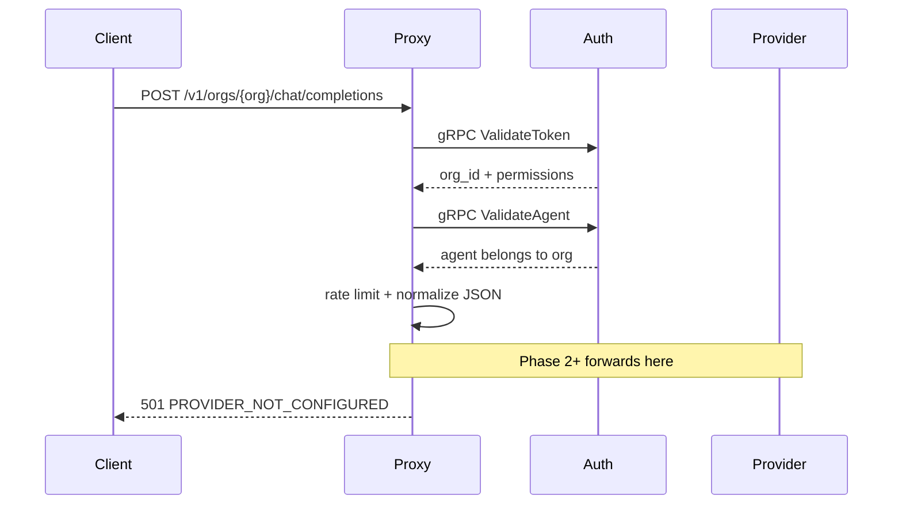

Clone the repo, boot dependencies with Docker Compose, start auth and proxy, and send a protected chat request. A **501** response means Phase 1 succeeded — auth, agent verify, and routing worked; provider forwarding ships in Phase 2.

<Callout type="note">
  Docker must be running with ports **8080**, **8081**, **9091**, **5432**, and **6379** free. Stuck? See [Troubleshooting](/docs/operations/troubleshooting).
</Callout>

## Prerequisites

- **Go 1.25+** and **GNU Make**
- **Docker Compose** v2
- **Git** (Git Bash on Windows for Make targets)
- OpenAI API key — optional until Phase 2; not used by the Phase 1 probe

## 1. Clone and configure

<CodeTabs>
  <CodeTab label="bash">
```bash title=".env (repo root)"
git clone https://github.com/Rick1330/ibex-harness.git
cd ibex-harness
cp .env.example .env
```
  </CodeTab>
  <CodeTab label="PowerShell">
```powershell title=".env (repo root)"
git clone https://github.com/Rick1330/ibex-harness.git
cd ibex-harness
Copy-Item .env.example .env
```
  </CodeTab>
</CodeTabs>

Set `IBEX_AUTH_VALIDATE_TIMEOUT=2s` in `services/proxy/.env` (or export it) — the production `50ms` budget often returns `503` on developer machines during Argon2 verification.

## 2. Boot infrastructure

```bash title="Terminal — repo root"
make compose-dev-up
make db-migrate
make db-seed
```

`make db-seed` prints a dev PAT and agent ID. Fixed wire-form PAT from seed:

```text
ibex_pat_00000000-0000-0000-0000-000000000004_LOCALDEVELOPMENTONLY
```

Org: `00000000-0000-0000-0000-000000000001` · Agent: `00000000-0000-0000-0000-000000000003`

## 3. Start services

In **separate terminals** (auth gRPC must be up before protected proxy routes):

```bash title="Terminal A — auth"
cd services/auth && go run .
```

```bash title="Terminal B — proxy"
cd services/proxy && go run .
```

Optional one-shot smoke after both are running:

```bash
make dev-smoke
```

## 4. Probe a protected route

Send an OpenAI-shaped chat request to the org-scoped path. Export credentials from seed output or use the fixed dev values:

<CodeTabs>
  <CodeTab label="curl">
```bash
export IBEX_TEST_PAT="ibex_pat_00000000-0000-0000-0000-000000000004_LOCALDEVELOPMENTONLY"
export IBEX_TEST_AGENT_ID="00000000-0000-0000-0000-000000000003"

curl -s -w "\nHTTP %{http_code}\n" \
  -X POST "http://localhost:8080/v1/orgs/00000000-0000-0000-0000-000000000001/chat/completions" \
  -H "Authorization: Bearer ${IBEX_TEST_PAT}" \
  -H "X-IBEX-Agent-ID: ${IBEX_TEST_AGENT_ID}" \
  -H "Content-Type: application/json" \
  -d '{"model":"gpt-4o","messages":[{"role":"user","content":"hello"}]}'
```
  </CodeTab>
  <CodeTab label="Node.js">
```javascript
const orgId = "00000000-0000-0000-0000-000000000001";
const pat = process.env.IBEX_TEST_PAT;
const agentId = process.env.IBEX_TEST_AGENT_ID;

const res = await fetch(
  `http://localhost:8080/v1/orgs/${orgId}/chat/completions`,
  {
    method: "POST",
    headers: {
      Authorization: `Bearer ${pat}`,
      "X-IBEX-Agent-ID": agentId,
      "Content-Type": "application/json",
    },
    body: JSON.stringify({
      model: "gpt-4o",
      messages: [{ role: "user", content: "hello" }],
    }),
  },
);

console.log(res.status, await res.text());
```
  </CodeTab>
  <CodeTab label="Python">
```python
import os
import requests

org_id = "00000000-0000-0000-0000-000000000001"
headers = {
    "Authorization": f"Bearer {os.environ['IBEX_TEST_PAT']}",
    "X-IBEX-Agent-ID": os.environ["IBEX_TEST_AGENT_ID"],
    "Content-Type": "application/json",
}
payload = {
    "model": "gpt-4o",
    "messages": [{"role": "user", "content": "hello"}],
}
r = requests.post(
    f"http://localhost:8080/v1/orgs/{org_id}/chat/completions",
    headers=headers,
    json=payload,
    timeout=10,
)
print(r.status_code, r.text)
```
  </CodeTab>
</CodeTabs>

### Expected response

**HTTP 501** with a JSON error envelope:

```json
{
  "error": {
    "code": "PROVIDER_NOT_CONFIGURED",
    "message": "No LLM provider adapter is configured for this deployment",
    "request_id": "01HXXXXXXXXXXXXXXXXXXXX"
  }
}
```

<Callout type="success" title="501 means success in Phase 1">
  Token validation, agent verification, body normalization, and routing all succeeded. The proxy intentionally stops before calling an LLM provider.
</Callout>

## Request flow



## What just happened

<ProcessSteps
  steps={[
    {
      title: 'Token validated',
      description:
        'The proxy called auth ValidateToken over gRPC with your bearer PAT.',
    },
    {
      title: 'Agent verified',
      description:
        'X-IBEX-Agent-ID was checked against the org in the URL path.',
    },
    {
      title: 'Body normalized',
      description:
        'JSON was parsed per ADR-0012; provider forwarding is deferred to Phase 2.',
    },
    {
      title: '501 returned',
      description:
        'No provider adapter is registered — expected until Phase 2.',
    },
  ]}
/>

## Common issues

| Symptom | Fix |
| --- | --- |
| `503 SERVICE_DEGRADED` on chat | Set `IBEX_AUTH_VALIDATE_TIMEOUT=2s` on proxy; ensure auth is running on `:9091` |
| `401` / `403` on chat | Re-run `make db-seed`; verify PAT and agent ID match seed output |
| `connection refused` on `:8080` | Start proxy after auth; check `IBEX_PORT` |
| Compose ports in use | Stop conflicting Postgres/Redis or change compose port mappings |

Full guide: [Troubleshooting](/docs/operations/troubleshooting).

## Next steps

- [Concepts](/docs/getting-started/concepts) — org, agent, and [PAT](/docs/glossary#pat) model
- [Docker Compose](/docs/deployment/docker-compose) — dependency stack detail
- [Chat completions API](/docs/api-reference/chat-completions) — 501 contract and headers
- [API errors](/docs/api-reference/errors) — full error code catalog
