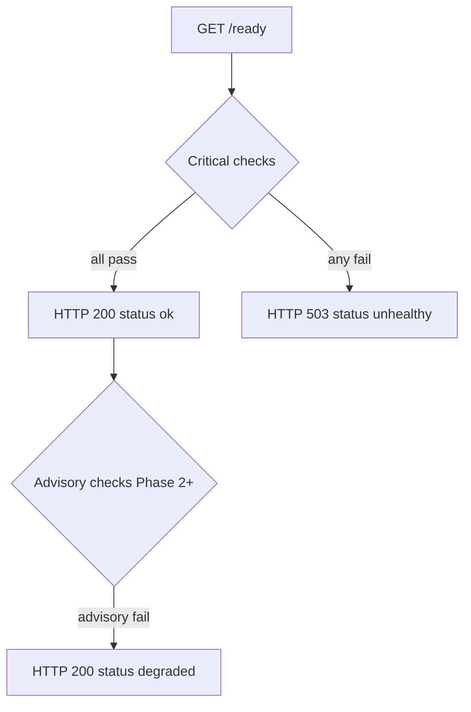

Auth and proxy expose two HTTP probe endpoints with distinct semantics. Liveness tells the orchestrator the process is alive; readiness tells the load balancer whether to send traffic. The contract is defined in [ADR-0022](/docs/adr/0022-health-check-contract) and implemented in `packages/healthcheck`.

<Callout type="note" title="Do not conflate probes">
  Point liveness at `/health` only. Using `/ready` for liveness restarts pods when a dependency blips — that makes outages worse.
</Callout>

## Endpoint summary

| Endpoint | Probe type | Checks deps | On failure |
| --- | --- | --- | --- |
| `GET /health` | Liveness | No | Orchestrator restarts the pod |
| `GET /ready` | Readiness | Yes (critical) | Pod removed from service endpoints |

### Response schema

```json
{
  "status": "ok",
  "checks": {
    "postgres": { "status": "ok", "latency_ms": 2 },
    "redis": { "status": "failed", "message": "connection refused", "latency_ms": 501 }
  }
}
```

| Field | Values |
| --- | --- |
| Top-level `status` | `ok` \| `degraded` \| `unhealthy` |
| `checks[name].status` | `ok` \| `failed` |
| `checks[name].message` | Present on failure — no secrets |
| `checks[name].latency_ms` | Wall time for that checker |

`/health` always returns HTTP **200** with `{"status":"ok","checks":{}}`.

## Readiness HTTP mapping

| Condition | HTTP | `status` field |
| --- | --- | --- |
| All critical checks pass | 200 | `ok` |
| Critical pass, advisory fail | 200 | `degraded` |
| Any critical check fails | 503 | `unhealthy` |

Phase 1 defines no advisory checks. `degraded` is reserved for Phase 2 (e.g. LLM provider reachability).



## Phase 1 checkers

### Auth service

| Checker | Type | What it does |
| --- | --- | --- |
| `postgres` | Critical | `SELECT 1` via connection pool |
| `grpc` | Critical | TCP reachability to gRPC listen port |

### Proxy service

| Checker | Type | What it does |
| --- | --- | --- |
| `auth_grpc` | Critical | `ValidateToken` probe; `Unauthenticated` means reachable |
| `redis` | Critical | `PING` over RESP |

<Callout type="warning" title="Empty REDIS_URL">
  When Redis is not configured, the redis checker fails and proxy `/ready` returns 503. Rate limiting uses a Noop limiter — acceptable for local dev without Redis if you accept not-ready status.
</Callout>

## Timeouts

| Budget | Value |
| --- | --- |
| Per checker | 500ms |
| Overall `/ready` request | 750ms |

Checkers run in parallel within the overall budget. Configure Kubernetes probe `timeoutSeconds: 2` to accommodate network overhead.

## Local verification

<CodeTabs>
  <CodeTab label="Auth">
```bash
curl -s http://localhost:8081/health | jq .
curl -s http://localhost:8081/ready  | jq .
```
  </CodeTab>
  <CodeTab label="Proxy">
```bash
curl -s http://localhost:8080/health | jq .
curl -s http://localhost:8080/ready  | jq .
make dev-smoke
```
  </CodeTab>
</CodeTabs>

## Kubernetes probes

Recommended configuration for auth and proxy Deployments:

```yaml
ports:
  - name: http
    containerPort: 8080   # auth: 8081 per IBEX_PORT

livenessProbe:
  httpGet:
    path: /health
    port: http
  periodSeconds: 10
  timeoutSeconds: 2
  failureThreshold: 3

readinessProbe:
  httpGet:
    path: /ready
    port: http
  periodSeconds: 5
  timeoutSeconds: 2
  failureThreshold: 2
  successThreshold: 1
```

<ProcessSteps
  steps={[
    {
      title: 'Liveness → /health',
      description:
        'Restarts only when the process is deadlocked or crashed — not when Postgres is briefly unavailable.',
    },
    {
      title: 'Readiness → /ready',
      description:
        'Removes the pod from the Service when auth gRPC or Redis (proxy) or Postgres (auth) is unreachable.',
    },
    {
      title: 'Verify after deploy',
      description:
        'Confirm at least N replicas return /ready 200 before declaring rollout complete.',
    },
  ]}
/>

## Related

- [Observability](/docs/operations/observability) — `/metrics` on the same HTTP port
- [Troubleshooting](/docs/operations/troubleshooting)
- [ADR-0022: Health check contract](/docs/adr/0022-health-check-contract)
