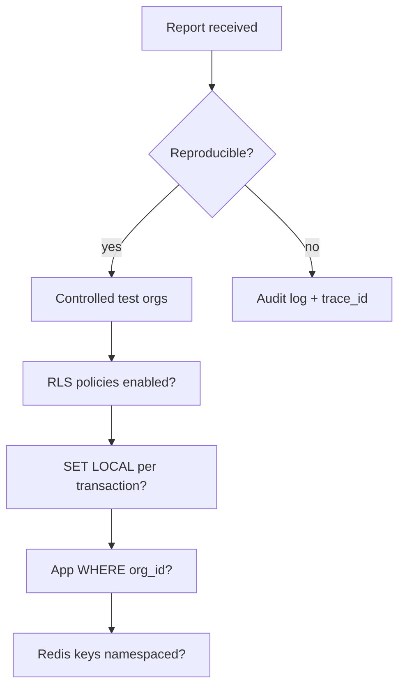

Runbooks are step-by-step procedures for alerts and incidents. They apply to Phase 1 services (auth, proxy) and shared dependencies (Postgres, Redis). Capture `trace_id`, deploy version, and a timeline from the first observation — never paste secrets into tickets or chat.

<Callout type="danger" title="Safety rules">
  Do not disable auth, rate limits, or RLS to recover service. Prefer rollback, scale-up, or reversible mitigations.
</Callout>

## Before you start

Open an incident note immediately:

```markdown
## Incident
Start time:
Severity:
Impact:
Services affected:

## Timeline
- [time] observed symptom
- [time] hypothesis + check
- [time] mitigation applied
- [time] recovery verified
```

## Runbook: Proxy down (P1)

### Alert signals

- `ibex_process_up{service="proxy"} == 0` for 1 minute
- Error rate above 10% for 5 minutes
- Customer report: LLM calls failing

### Likely causes

- Bad deploy or crash loop
- Missing required environment variables
- OOMKilled under load
- Readiness failure misconfigured as liveness (avoidable restarts)

### Immediate actions (first 15 minutes)

<Steps>
  <Step title="Confirm blast radius">
    All traffic or single region? Is ingress reachable?
  </Step>
  <Step title="Inspect pods">
    CrashLoopBackOff, OOMKilled, ImagePullBackOff?
  </Step>
  <Step title="Recent deploy">
    If a rollout started near onset, prepare rollback to last known-good image digest.
  </Step>
</Steps>

<CodeTabs>
  <CodeTab label="Kubernetes">
```bash
kubectl -n ibex-system get pods -l app=proxy
kubectl -n ibex-system describe pod <proxy-pod>
kubectl -n ibex-system logs <proxy-pod> --previous
```
  </CodeTab>
  <CodeTab label="Local compose-dev">
```bash
curl -s http://localhost:8080/health
curl -s http://localhost:8080/ready
# Check proxy terminal for panic or missing env var at startup
```
  </CodeTab>
</CodeTabs>

### Mitigation

1. Roll back to last known-good image (preferred — proxy is stateless)
2. Scale replicas up if load spike
3. If auth is down: proxy should stay **live** (`/health` 200) but **not ready** (`/ready` 503) — do not point liveness at `/ready`

### Recovery verification

- `/health` returns 200 on N replicas
- `/ready` returns 200
- Error rate and `ibex_proxy_request_duration_seconds` p99 back to baseline
- `make dev-smoke` passes locally after fix

---

## Runbook: Auth validation failures spike (P1/P2)

### Alert signals

- Spike in 401 responses across proxy
- Dashboard login failures (Phase 2+)
- `ibex_auth_validate_token_duration_seconds` errors rising

### Likely causes

- Client mass misconfiguration (wrong token deployed)
- Token revocation or expiration bug
- JWT key rotation mismatch (`kid` not in keyset)
- Clock skew between services

### Diagnosis

<ProcessSteps
  steps={[
    {
      title: 'Classify failure type',
      description:
        'Invalid vs expired vs revoked vs org_suspended — error codes in logs and metrics result labels.',
    },
    {
      title: 'Check concentration',
      description:
        'Single org suggests client misconfig; many IPs suggests brute force or attack.',
    },
    {
      title: 'JWT keyset',
      description:
        'Verify JWT_KEY_ID_CURRENT matches a key in JWT_PUBLIC_KEYS_PEM on all verifiers.',
    },
    {
      title: 'Clock sync',
      description:
        'NTP drift causes premature expiry if services disagree on time.',
    },
  ]}
/>

### Mitigation

| Cause | Action |
| --- | --- |
| Attack suspected | Tighten auth endpoint rate limits; notify security |
| Key rotation bug | Restore previous public key in keyset; redeploy verifiers |
| Client misconfig | Notify impacted org; issue new PAT — avoid extending expired tokens |

### Verification

- 401 rate returns to baseline
- Proxy auth cache hit rate stable
- Protected route smoke test returns expected 501 (auth passed)

---

## Runbook: Suspected tenant isolation violation (P1)

### Alert signals

- User report: seeing another org's data
- Audit log anomaly
- Cross-tenant access in telemetry (should be impossible)

### Immediate actions — do not delay

<Steps>
  <Step title="Declare P1">
    Freeze deployments. Start incident timeline.
  </Step>
  <Step title="Enable safe logging">
    Enhanced audit mode — still no raw tokens or memory content in logs.
  </Step>
  <Step title="Identify path">
    API endpoint, Redis key namespace, ClickHouse query, or connection pool org context leak?
  </Step>
</Steps>

### Diagnosis plan



1. Confirm with controlled test orgs if possible
2. Verify RLS policies enabled on `ibex_core` tables
3. Search code path for queries missing `org_id`
4. Inspect Redis keys for missing org prefix
5. For analytics: confirm query guard rejected unscoped ClickHouse SQL

### Mitigation

- Fail closed when org context is missing or mismatched
- Hotfix query guards and key namespacing
- If uncertain: disable affected endpoint via feature flag while preserving core proxy traffic

<Callout type="warning" title="Never return 404 for cross-tenant">
  Cross-tenant probes must get 403. A 404 confirms resource existence to an attacker.
</Callout>

### Verification

- Cross-tenant integration tests pass in staging
- Reproduction no longer possible
- Postmortem with regression tests committed

---

## Severity reference

| Level | Examples |
| --- | --- |
| P1 | Tenant isolation breach, secret compromise, auth bypass, proxy total outage |
| P2 | Sustained p99 overhead regression, Redis degraded, DB failover |
| P3 | Analytics delay, non-blocking dashboard issues |

## Related

- [Security overview](/docs/security/overview)
- [Tenant isolation](/docs/security/tenant-isolation)
- [Troubleshooting](/docs/operations/troubleshooting)
- [Health checks](/docs/operations/health-checks)
