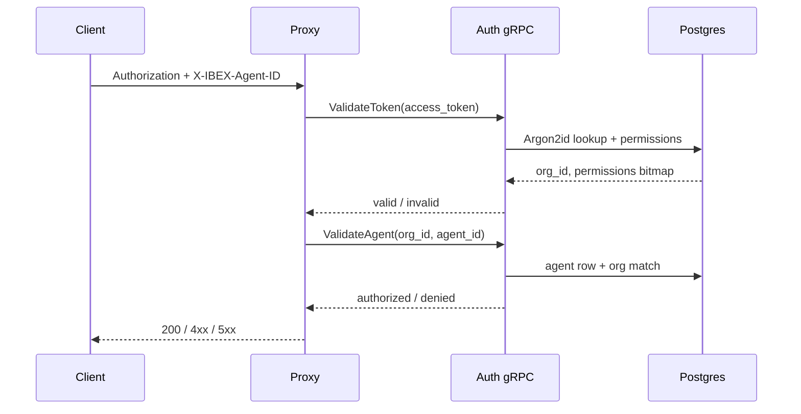

Protected proxy routes require two credentials: a Personal Access Token (PAT) in the `Authorization` header and an active agent UUID in `X-IBEX-Agent-ID`. The proxy never stores token hashes — every validation is delegated to the auth service over gRPC ([ADR-0011](/docs/adr/0011-proxy-auth-client), [ADR-0016](/docs/adr/0016-agent-identity-verification)).

<Callout type="warning" title="Fail-closed on auth outage">
  When auth gRPC is unavailable, token validation returns `503 SERVICE_DEGRADED` and agent verification returns `503 AUTH_UNAVAILABLE`. There is no permission cache bypass in Phase 1.
</Callout>

## Required headers

| Header | Required on | Description |
| --- | --- | --- |
| `Authorization` | All protected routes | `Bearer ibex_pat_<uuid>_<secret>` |
| `X-IBEX-Agent-ID` | All protected routes | UUID of an **active** agent owned by the token's org |
| `Content-Type` | `POST` bodies | Must be `application/json` on chat completions |

Organization scope is derived from the **validated token**, not from request body fields. Never send `org_id` in JSON to select a tenant — that would be a spoofing vector. See [Security authentication](/docs/security/authentication).

## Validation flow



Chat completions additionally require the `ProxyChatCompletion` permission bit on the token ([ADR-0009](/docs/adr/0009-permission-bitmap)).

## Path org enforcement

Two probe routes help integrators verify credentials:

<Endpoint method="GET" path="/v1/internal/auth-probe" description="Returns org_id and permissions from the validated token. No path org parameter." />

<Endpoint method="GET" path="/v1/orgs/{org_id}/auth-probe" description="Same response shape; path org_id must equal token org or returns 403." />

Cross-tenant path access returns `403` with an ambiguous message — not `404` — to prevent resource enumeration. This is enforced at every layer: middleware, gRPC handler, store WHERE clause, and Postgres RLS. Details: [Tenant isolation](/docs/security/tenant-isolation).

## Probe examples

<CodeTabs>
  <CodeTab label="curl">
```bash
# Internal probe — org from token
curl -s http://localhost:8080/v1/internal/auth-probe \
  -H "Authorization: Bearer ${IBEX_DEV_TOKEN}" \
  -H "X-IBEX-Agent-ID: ${IBEX_DEV_AGENT_ID}"

# Path org probe — must match token org
curl -s "http://localhost:8080/v1/orgs/${IBEX_DEV_ORG_ID}/auth-probe" \
  -H "Authorization: Bearer ${IBEX_DEV_TOKEN}" \
  -H "X-IBEX-Agent-ID: ${IBEX_DEV_AGENT_ID}"
```
  </CodeTab>
  <CodeTab label="PowerShell">
```powershell
$headers = @{
  Authorization = "Bearer $env:IBEX_DEV_TOKEN"
  "X-IBEX-Agent-ID" = $env:IBEX_DEV_AGENT_ID
}
Invoke-RestMethod http://localhost:8080/v1/internal/auth-probe -Headers $headers
```
  </CodeTab>
</CodeTabs>

Successful probe response:

```json
{
  "org_id": "00000000-0000-0000-0000-000000000001",
  "permissions": 23
}
```

## Chat completion probe

After auth and agent checks pass, chat returns `501` in Phase 1 — that is success for credential verification:

<CodeTabs>
  <CodeTab label="curl">
```bash
curl -s -X POST http://localhost:8080/v1/chat/completions \
  -H "Authorization: Bearer ${IBEX_DEV_TOKEN}" \
  -H "X-IBEX-Agent-ID: ${IBEX_DEV_AGENT_ID}" \
  -H "Content-Type: application/json" \
  -d '{"model":"gpt-4o","messages":[{"role":"user","content":"ping"}]}'
```
  </CodeTab>
  <CodeTab label="PowerShell">
```powershell
$headers = @{
  Authorization = "Bearer $env:IBEX_DEV_TOKEN"
  "Content-Type" = "application/json"
  "X-IBEX-Agent-ID" = $env:IBEX_DEV_AGENT_ID
}
$body = '{"model":"gpt-4o","messages":[{"role":"user","content":"ping"}]}'
Invoke-RestMethod -Uri http://localhost:8080/v1/chat/completions -Method POST -Headers $headers -Body $body
```
  </CodeTab>
</CodeTabs>

Expected: HTTP **501** with `error.code` = `PROVIDER_NOT_CONFIGURED`.

## Error matrix

| HTTP | Code | When |
| --- | --- | --- |
| `401` | `UNAUTHORIZED` | Missing, malformed, expired, or revoked PAT |
| `400` | `MISSING_AGENT_ID` | `X-IBEX-Agent-ID` absent or not a UUID |
| `403` | `AGENT_NOT_AUTHORIZED` | Agent missing, wrong org, or cross-tenant path |
| `403` | `AGENT_SUSPENDED` | Agent exists but is not active |
| `403` | `PATH_ORG_MISMATCH` | Path `org_id` ≠ token org on org-scoped routes |
| `503` | `SERVICE_DEGRADED` | Auth gRPC timeout or unavailable on token validation |
| `503` | `AUTH_UNAVAILABLE` | Auth gRPC failure on agent verification |

Full envelope reference: [API errors](/docs/api-reference/errors). Security integration tests cover 35+ negative cases — see [current state](/roadmap/current-state).

## Issue a dev PAT

<Steps>
  <Step title="Seed local data">
    `make db-seed` writes a fixed dev PAT and exports `IBEX_DEV_TOKEN`, `IBEX_DEV_AGENT_ID`, `IBEX_DEV_ORG_ID`.
  </Step>
  <Step title="Or create via gRPC">
    Use `CreateToken` with an admin bearer — see [Issuing API keys](/docs/auth/issuing-api-keys).
  </Step>
  <Step title="Never log secrets">
    Log only token prefixes in application code. Rotation procedure: [Secrets and keys](/docs/security/secrets-and-keys).
  </Step>
</Steps>

## Related

- [Auth overview](/docs/auth/overview) — gRPC surface and token lifecycle
- [Org and project model](/docs/auth/org-project-model) — how agents map to orgs
- [Overview](/docs/proxy/overview) — full middleware order
- [Request routing](/docs/proxy/request-routing) — body validation after auth
