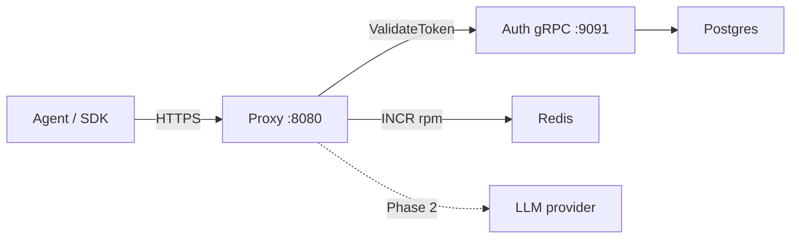

The proxy is the public HTTP edge for IBEX Harness. Every protected request passes through authentication, agent identity verification, rate limiting, and request normalization before any provider handoff. In Phase 1 the critical path stops at validation — chat routes return `501 PROVIDER_NOT_CONFIGURED` until Phase 2 registers a provider adapter.

<Callout type="note" title="Phase 1 scope">
  Auth, agent verify, semantic validation, and org-level rate limits are production-ready today. LLM forwarding, context injection, and memory retrieval are **not** wired yet. Track live status on [current state](/roadmap/current-state).
</Callout>

## Role in the platform

The proxy is stateless by design: it holds no Postgres connection in Phase 1. Identity lookups go through the [auth service](/docs/auth/overview) over gRPC; rate-limit counters live in Redis. That separation keeps the critical path horizontally scalable and avoids multi-master write complexity.

See [Architecture overview](/docs/architecture/overview) for the full system diagram and [Request lifecycle](/docs/architecture/request-lifecycle) for the end-to-end flow.

## Endpoint surface

| Route | Auth | Purpose |
| --- | --- | --- |
| `GET /health` | No | Liveness — minimal JSON per [ADR-0022](/docs/adr/0022-health-check-contract) |
| `GET /ready` | No | Readiness — probes `auth_grpc` and `redis` when configured |
| `GET /metrics` | No | Prometheus text exposition |
| `GET /v1/internal/auth-probe` | PAT + agent | Returns `{org_id, permissions}` from validated token |
| `GET /v1/orgs/{org_id}/auth-probe` | PAT + agent | Same probe; path `org_id` must match token org |
| `POST /v1/chat/completions` | PAT + agent + `ProxyChatCompletion` | OpenAI-compatible chat; **501** until provider configured |

Organization scope for chat comes from the **validated token**, not the URL path. Cross-tenant path probes return `403` — see [Tenant isolation](/docs/security/tenant-isolation).

## Middleware pipeline

Global middleware wraps every route: metrics → request context → response headers → logging → mux.

Protected routes add route-specific chains. For chat completions:

<ProcessSteps
  steps={[
    {
      title: 'Body limit and Content-Type',
      description:
        'Rejects oversize payloads and non-JSON POST bodies before auth runs (ADR-0013).',
    },
    {
      title: 'Token validation',
      description:
        'Calls auth ValidateToken over gRPC with a 50ms production budget (ADR-0011).',
    },
    {
      title: 'Agent verification',
      description:
        'Requires X-IBEX-Agent-ID; confirms active agent belongs to token org (ADR-0016).',
    },
    {
      title: 'Rate limit',
      description:
        'Org-level RPM in Redis; fail-open when Redis is unavailable (ADR-0015).',
    },
    {
      title: 'Normalize and validate',
      description:
        'Parses OpenAI chat JSON; semantic errors return field_errors in the envelope (ADR-0012).',
    },
  ]}
/>

Auth-probe routes skip body limit and Content-Type checks but still run auth, agent verify, and rate limit.

## Failure modes

| Dependency | Behavior | HTTP signal |
| --- | --- | --- |
| Auth gRPC down / timeout | Fail **closed** on token validation | `503 SERVICE_DEGRADED` |
| Auth gRPC down on agent verify | Fail **closed** | `503 AUTH_UNAVAILABLE` |
| Redis down | Rate limit **skipped** (fail-open) | Request proceeds; monitor `/ready` |
| No provider registered | Expected in Phase 1 | `501 PROVIDER_NOT_CONFIGURED` |

Full threat-model context: [Security overview](/docs/security/overview) and [Authentication](/docs/security/authentication).

## Response headers

Every response includes correlation headers (names configurable via env):

- `X-Request-ID` — UUID v7 when generated; valid inbound v4/v7 UUIDs are honoured ([ADR-0017](/docs/adr/0017-request-id-strategy))
- `X-Trace-ID` — OpenTelemetry trace correlation
- `X-Response-Time` — server-side duration

Protected routes with rate limiting enabled also emit `X-RateLimit-Limit`, `X-RateLimit-Remaining`, and `X-RateLimit-Reset`. `429` responses add `Retry-After`.

## Verify locally

<Steps>
  <Step title="Boot dependencies">
    `make compose-dev-up && make db-migrate && make db-seed`
  </Step>
  <Step title="Start auth then proxy">
    Auth must listen on gRPC `9091` before the proxy starts. See [Configuration](/docs/proxy/configuration).
  </Step>
  <Step title="Health check">
    `curl -s http://localhost:8080/health` — expect HTTP 200.
  </Step>
  <Step title="Smoke test">
    `make dev-smoke` exercises probes, auth failures, and the chat stub.
  </Step>
</Steps>

## Related guides

- [Authentication](/docs/proxy/authentication) — headers, error codes, probe examples
- [Configuration](/docs/proxy/configuration) — env vars and readiness dependencies
- [Rate limiting](/docs/proxy/rate-limiting) — RPM budgets and Redis keys
- [Request routing](/docs/proxy/request-routing) — normalization rules and chat schema
- [Provider adapters](/docs/proxy/provider-adapters) — Phase 2 forwarding contract
