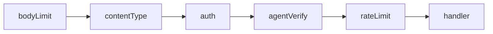

The proxy exposes an OpenAI-compatible chat completion endpoint and diagnostic auth probes. In Phase 1 every chat request is parsed, validated, and authenticated end-to-end; provider forwarding stops with `501 PROVIDER_NOT_CONFIGURED` until Phase 2 registers an adapter ([ADR-0012](/docs/adr/0012-proxy-request-normalization), [ADR-0013](/docs/adr/0013-proxy-input-validation-and-error-envelope)).

<Callout type="note" title="Org scope from token">
  `POST /v1/chat/completions` does **not** include `org_id` in the URL. Tenant scope comes from the validated PAT. Path-based org probes exist only on `/v1/orgs/{org_id}/auth-probe`.
</Callout>

## Protected routes

<Endpoint
  method="POST"
  path="/v1/chat/completions"
  description="OpenAI-compatible chat completions. Requires ProxyChatCompletion permission. Phase 1 returns 501 after validation."
/>

<Endpoint
  method="GET"
  path="/v1/internal/auth-probe"
  description="Diagnostic route returning org_id and permissions from the bearer token."
/>

<Endpoint
  method="GET"
  path="/v1/orgs/{org_id}/auth-probe"
  description="Diagnostic route with explicit path org; must match token org."
/>

## Middleware chain for chat



Global middleware (metrics, request ID, logging) wraps all routes. Chat-specific middleware runs in the order above — auth never executes on oversize or wrong Content-Type bodies.

## Normalization pipeline

<ProcessSteps
  steps={[
    {
      title: 'Body size gate',
      description:
        'Payloads over IBEX_MAX_REQUEST_BODY_BYTES (default 1 MiB) return 413 before JSON parse.',
    },
    {
      title: 'Content-Type gate',
      description: 'POST bodies must be application/json; otherwise 415.',
    },
    {
      title: 'JSON parse',
      description:
        'Malformed JSON returns 400 INVALID_JSON with request_id in the envelope.',
    },
    {
      title: 'Semantic validation',
      description:
        'Required fields (model, messages) produce field_errors array per ADR-0013.',
    },
    {
      title: 'Provider handoff',
      description: 'Phase 1 stub returns 501 PROVIDER_NOT_CONFIGURED.',
    },
  ]}
/>

## Minimal valid body

```json
{
  "model": "gpt-4o",
  "messages": [
    { "role": "user", "content": "Hello" }
  ]
}
```

## Validation error example

HTTP **400** with structured field errors:

```json
{
  "error": {
    "code": "VALIDATION_ERROR",
    "message": "Request validation failed",
    "request_id": "0192a3b4-c5d6-7890-abcd-ef1234567890",
    "timestamp": "2026-06-14T12:00:00Z",
    "field_errors": [
      {
        "field": "model",
        "code": "REQUIRED",
        "message": "model is required"
      }
    ]
  }
}
```

Optional `docs_url` appears when `IBEX_ERROR_DOCS_BASE` is configured — links to [API errors](/docs/api-reference/errors).

## Send a routed request

<CodeTabs>
  <CodeTab label="curl">
```bash
curl -s -w "\nHTTP %{http_code}\n" \
  -X POST http://localhost:8080/v1/chat/completions \
  -H "Authorization: Bearer ${IBEX_DEV_TOKEN}" \
  -H "X-IBEX-Agent-ID: ${IBEX_DEV_AGENT_ID}" \
  -H "Content-Type: application/json" \
  -d '{"model":"gpt-4o","messages":[{"role":"user","content":"ping"}]}'
```
  </CodeTab>
  <CodeTab label="PowerShell">
```powershell
$headers = @{
  Authorization = "Bearer $env:IBEX_DEV_TOKEN"
  "Content-Type" = "application/json"
  "X-IBEX-Agent-ID" = $env:IBEX_DEV_AGENT_ID
}
$body = '{"model":"gpt-4o","messages":[{"role":"user","content":"ping"}]}'
Invoke-RestMethod -Uri http://localhost:8080/v1/chat/completions -Method POST -Headers $headers -Body $body
```
  </CodeTab>
</CodeTabs>

Phase 1 expected: HTTP **501**, `error.code` = `PROVIDER_NOT_CONFIGURED`. That confirms routing, auth, agent verify, rate limit, and validation all succeeded.

## Path org enforcement

On `/v1/orgs/{org_id}/auth-probe`, the path parameter must be a valid UUID and must equal the organization embedded in the validated token. Cross-tenant attempts return **403** — never **404** — per [Security authentication](/docs/security/authentication).

| Scenario | HTTP | Code |
| --- | --- | --- |
| Invalid UUID in path | `400` | `INVALID_PATH_ORG` |
| Token org A, path org B | `403` | `PATH_ORG_MISMATCH` |
| Matching org | `200` | — |

## Request correlation

Every response includes:

- `X-Request-ID` — propagated to auth gRPC as `x-request-id` metadata
- `X-Trace-ID` — OpenTelemetry trace
- `X-Response-Time` — handler duration

Use `request_id` from JSON errors to grep proxy and auth logs during integration debugging. See [Request lifecycle](/docs/architecture/request-lifecycle).

## Phase 2 forwarding

When a provider adapter registers, the handler will:

1. Select adapter by model prefix or org configuration
2. Attach org/agent metadata for audit and tracing
3. Stream OpenAI-compatible SSE or JSON back to the client

Until then, treat `501` as the healthy Phase 1 outcome. Track progress: [Provider adapters](/docs/proxy/provider-adapters) and [roadmap](/roadmap/phase-2-single-provider).

## Related

- [Authentication](/docs/proxy/authentication) — credentials required before routing
- [Provider adapters](/docs/proxy/provider-adapters) — Phase 2 upstream contract
- [Overview](/docs/proxy/overview) — full endpoint table
- [Chat completions](/docs/api-reference/chat-completions) — Phase 1 HTTP stub
