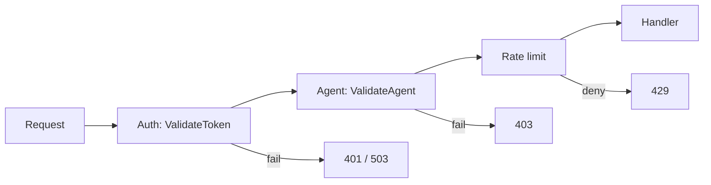

Every protected proxy request passes through token validation and agent identity verification before the handler runs. The proxy delegates to the auth service over gRPC — it never stores token hashes locally. For service responsibilities and token issuance, see the [Auth service docs](/docs/auth/overview).

<Callout type="warning" title="Fail closed">
  Auth or agent verification failures deny the request. There is no anonymous fallback on protected routes. Auth gRPC outage returns **503** `AUTH_UNAVAILABLE`, not passthrough.
</Callout>

## Token types

IBEX Harness supports several token classes. Each has a different risk profile and rotation policy.

| Type | Lifetime | Typical use | Storage |
| --- | --- | --- | --- |
| Personal Access Token (PAT) | Until revoked | SDK and server integrations | Argon2id hash in Postgres |
| Organization token | Rotatable | Production agents | Same as PAT |
| Dashboard session (JWT) | ~1 hour | Operator UI (Phase 2+) | RS256 signed; refresh rotation |
| Service token | ~24 hours | Internal service-to-service | Narrow scopes; auto-rotation |
| Marketplace token | Scoped | Publish/install resources (Phase 3+) | Narrow scope only |

<Callout type="tip" title="Phase 1 focus">
  Phase 1 implements PAT validation via gRPC `ValidateToken` and `ValidateAgent`. Dashboard JWT and OIDC flows are documented for completeness; full dashboard auth ships later.
</Callout>

## Proxy middleware order

Protected routes run middleware in this order:



<Steps>
  <Step title="Token validation">
    gRPC `ValidateToken` resolves org_id and permission bitmap from the bearer token. Invalid, expired, or revoked tokens return **401**.
  </Step>
  <Step title="Agent identity">
    gRPC `ValidateAgent(agent_id, org_id_from_token)` requires header `X-IBEX-Agent-ID`. Cross-org or inactive agents return **403** (`AGENT_NOT_AUTHORIZED`), never **404**.
  </Step>
  <Step title="Rate limit">
    Org-level RPM via Redis. Redis errors fail open per [ADR-0015](/docs/adr/0015-proxy-rate-limit-skeleton).
  </Step>
</Steps>

## Required headers

<ParamTable
  params={[
    {
      name: 'Authorization',
      type: 'string',
      required: true,
      description: 'Bearer token — PAT issued by auth service CreateToken.',
    },
    {
      name: 'X-IBEX-Agent-ID',
      type: 'uuid',
      required: true,
      description: 'Calling agent UUID; must belong to the org in the URL path.',
    },
    {
      name: 'Content-Type',
      type: 'string',
      required: true,
      description: 'application/json on POST bodies with a JSON payload.',
    },
  ]}
/>

## Probe a protected route

<CodeTabs>
  <CodeTab label="curl">
```bash
curl -s -w "\nHTTP %{http_code}\n" \
  -X POST "http://localhost:8080/v1/orgs/${IBEX_DEV_ORG_ID}/chat/completions" \
  -H "Authorization: Bearer ${IBEX_DEV_TOKEN}" \
  -H "X-IBEX-Agent-ID: ${IBEX_DEV_AGENT_ID}" \
  -H "Content-Type: application/json" \
  -d '{"model":"gpt-4o","messages":[{"role":"user","content":"ping"}]}'
```
  </CodeTab>
  <CodeTab label="PowerShell">
```powershell
$headers = @{
  Authorization = "Bearer $env:IBEX_DEV_TOKEN"
  "X-IBEX-Agent-ID" = $env:IBEX_DEV_AGENT_ID
  "Content-Type" = "application/json"
}
Invoke-RestMethod -Method POST `
  -Uri "http://localhost:8080/v1/orgs/$env:IBEX_DEV_ORG_ID/chat/completions" `
  -Headers $headers `
  -Body '{"model":"gpt-4o","messages":[{"role":"user","content":"ping"}]}'
```
  </CodeTab>
</CodeTabs>

Phase 1 expected: **501** `PROVIDER_NOT_CONFIGURED` — auth and agent checks passed; provider forwarding is deferred.

## Error responses

| HTTP | Code | Meaning |
| --- | --- | --- |
| 401 | `MISSING_TOKEN`, `INVALID_TOKEN` | No bearer or token not valid |
| 403 | `AGENT_NOT_AUTHORIZED`, `INSUFFICIENT_PERMISSIONS` | Agent wrong org or missing permission bit |
| 503 | `AUTH_UNAVAILABLE`, `SERVICE_DEGRADED` | Auth gRPC unreachable or degraded |

All errors use the stable JSON envelope documented in [Errors](/docs/api-reference/errors).

## Authorization model

Permissions use a 64-bit bitmap ([ADR-0009](/docs/adr/0009-permission-bitmap)). Phase 1 proxy chat minimum: `MemoryRead | SessionCreate | SessionRead`. Token create/revoke requires explicit `TokenCreate` / `TokenRevoke` bits.

<Callout type="note" title="Authentication ≠ authorization">
  A valid token does not imply access to every resource in the org. Endpoints declare required permissions; cross-tenant resource IDs return 403.
</Callout>

## Local dev timeout

Argon2 verify on developer machines can exceed the production 50ms auth budget. If smoke tests return **503**, increase the validate timeout:

```bash
IBEX_AUTH_VALIDATE_TIMEOUT=2s go run ./services/proxy/cmd/proxy
```

See [Troubleshooting](/docs/operations/troubleshooting) for migration and compose-dev issues.

## Related

- [Issuing API keys](/docs/auth/issuing-api-keys)
- [Proxy authentication](/docs/proxy/authentication)
- [ADR-0011: Proxy auth client](/docs/adr/0011-proxy-auth-client)
- [ADR-0016: Agent identity verification](/docs/adr/0016-agent-identity-verification)
