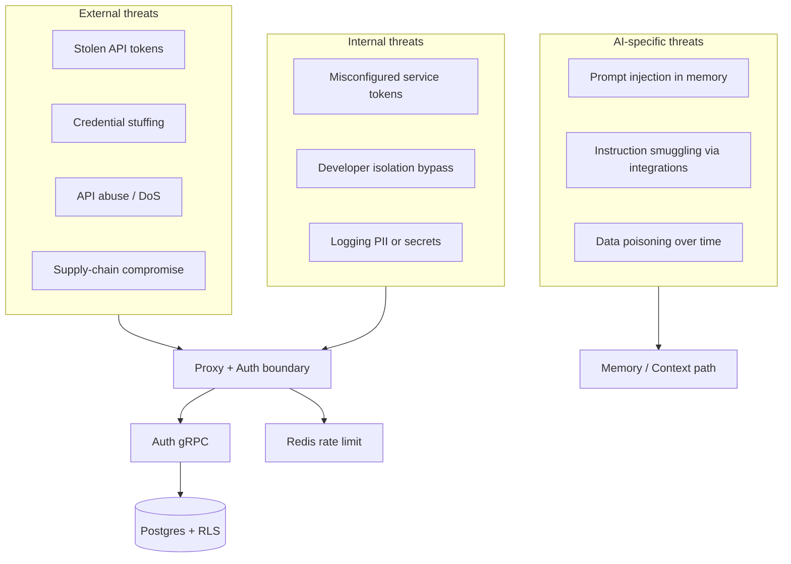

IBEX Harness sits on a high-value data path — LLM traffic, persistent memory, org-scoped tokens, and billing events. Security is an invariant, not a phase. This page summarizes what must always be true and what we defend against in Phase 1 (auth + proxy).

<Callout type="note" title="Phase 1 scope">
  Phase 1 validates auth, agent identity, rate limits, and error envelopes via the `security-integration` CI job. Memory injection defenses and dashboard MFA ship in later phases.
</Callout>

## Security objectives

These six objectives (S1–S6) are non-negotiable across every release.

<ProcessSteps
  steps={[
    {
      title: 'S1 — Tenant isolation',
      description:
        'Org A must never access Org B data via API, database, cache, logs, analytics, or exports. Cross-tenant resource access returns 403 (PERMISSION_DENIED), never 404.',
    },
    {
      title: 'S2 — Confidentiality of secrets',
      description:
        'Tokens, API keys, passwords, and signing keys must never appear in git history, logs, crash dumps, analytics payloads, or client-side bundles.',
    },
    {
      title: 'S3 — Integrity of billing and audit records',
      description:
        'Billing events and audit logs are append-only, tamper-resistant, and recorded at least once — never silently dropped.',
    },
    {
      title: 'S4 — Least privilege authorization',
      description:
        'Authentication is not authorization. Every operation checks token validity, permission bitmap, org ownership, and explicit roles for sensitive actions.',
    },
    {
      title: 'S5 — Safe prompt and memory handling',
      description:
        'Memory content is untrusted input. Write-time quarantine, retrieval-time delimiters, and directive rules prevent prompt injection from stored content.',
    },
    {
      title: 'S6 — Secure failure modes',
      description:
        'Auth and tenant isolation fail closed. Memory and context injection fail gracefully (degraded quality, still safe). Missing checks never accidentally allow operations.',
    },
  ]}
/>

## Threat model summary

| Category | Examples | Primary controls (Phase 1) |
| --- | --- | --- |
| External | Token theft, brute force, cost amplification | PAT hashing (Argon2id), org RPM limits, input size caps |
| Internal | Broad service tokens, missing org filters | RLS + application-layer org checks, bounded permission bitmap |
| AI-specific | Injection stored in memory, role confusion | Quarantine thresholds (Phase 2+), nonce-wrapped retrieval |

<Callout type="warning" title="ClickHouse has no RLS">
  Analytics queries must include an explicit `org_id` filter. A query guard rejects statements missing tenant scope in production.
</Callout>

## Fail closed vs fail open

| Scenario | Behavior |
| --- | --- |
| org_id context not set | **Fail closed** — deny access |
| Token validation incomplete (no safe cache) | **Fail closed** — 503 `AUTH_UNAVAILABLE` |
| Permission check ambiguous | **Fail closed** — 403 |
| Redis unavailable (rate limit) | **Fail open** — allow request, log warning ([ADR-0015](/docs/adr/0015-proxy-rate-limit-skeleton)) |
| Memory retrieval timeout | **Fail open** — directive-only context |

<Callout type="danger" title="Never disable controls to recover">
  Do not temporarily disable auth, rate limits, or RLS during incidents. Prefer rollback, scale-up, or circuit breakers.
</Callout>

## Phase 1 validated invariants

The following behaviors are enforced by automated security tests in CI:

| Invariant | Expected behavior |
| --- | --- |
| Missing or invalid token | Rejected before handler (401) |
| Cross-org agent header | 403, not 404 |
| Revoked token | Rejected promptly |
| Auth service down | 503 with stable JSON envelope |
| Rate limits | Per-org RPM with correct headers |
| Permission bitmap | Enforced on protected routes |

## Related pages

- [Authentication](/docs/security/authentication) — token types and fail-closed pipeline
- [Tenant isolation](/docs/security/tenant-isolation) — RLS and Redis namespacing
- [Secrets and keys](/docs/security/secrets-and-keys) — rotation and env var contract
- [Auth service](/docs/auth/overview) — gRPC validation surface
