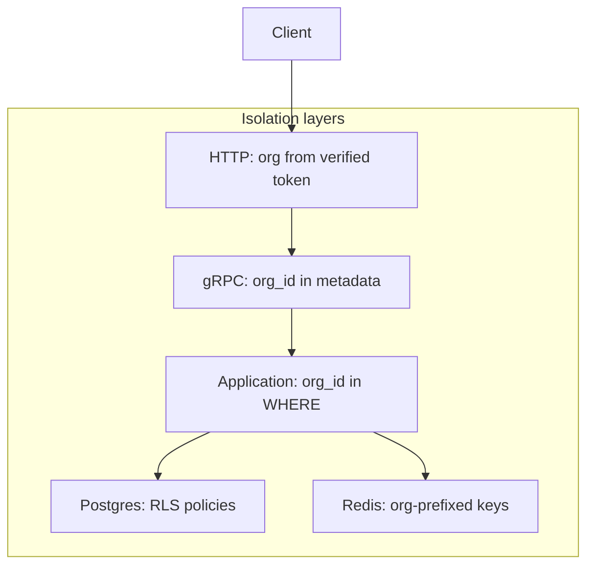

Org A must never read or mutate Org B's data — via API, Postgres, Redis, logs, or analytics. IBEX Harness enforces isolation at multiple layers so a single regression cannot bypass tenancy. Phase 1 protects core identity tables; memory and ClickHouse guards expand in later phases.

<Callout type="danger" title="P1 incident">
  Any suspected cross-tenant data leak is severity P1. Freeze deploys, enable enhanced audit logging, and follow the [incident response runbook](/docs/operations/incident-response).
</Callout>

## Defense in depth



Each layer is independent. If RLS is misconfigured, application queries still filter by org. If application code regresses, RLS denies cross-tenant rows.

## PostgreSQL row-level security

Every tenant table in `ibex_core` includes `org_id`. RLS policies enforce:

```sql
org_id = current_setting('app.current_org_id')::uuid
```

<Steps>
  <Step title="Set org context per transaction">
    Every request runs `SET LOCAL app.current_org_id = '{org_id}'` inside a transaction scope — never globally on the pooled connection.
  </Step>
  <Step title="Fail closed on missing context">
    If org context cannot be set, the operation is denied rather than running unscoped queries.
  </Step>
  <Step title="Verify policies in dev">
    After `make db-migrate`, confirm RLS is enabled on core tables.
  </Step>
</Steps>

### Phase 1 protected tables

| Table | Policy |
| --- | --- |
| `ibex_core.organizations` | Org-scoped reads |
| `ibex_core.tokens` | Org-scoped CRUD |
| `ibex_core.agents` | Org-scoped CRUD |
| `ibex_core.users` | Org-scoped membership |

See [Multi-tenant RLS](/docs/auth/multi-tenant-rls) for migration and verification commands.

<Callout type="warning" title="Use SET LOCAL, not SET">
  `SET app.current_org_id` without `LOCAL` can leak org context across pooled connections. Always scope context to the current transaction.
</Callout>

## Application layer

Even with RLS enabled, every store query includes `org_id` in the WHERE clause:

- Makes intent obvious in code review
- Reduces blast radius if a policy is disabled during migration
- Required for services that do not yet have RLS (ClickHouse)

Cross-tenant access attempts return **403 PERMISSION_DENIED**, not **404 Not Found**. Returning 404 tells an attacker the resource UUID exists in another org.

## Redis namespacing

Phase 1 proxy uses Redis for org-level rate limiting and readiness checks. Keys must include org_id as a segment:

| Pattern | Example |
| --- | --- |
| Rate limit | `ratelimit:{org_id}:minute:{unix_minute}` |
| Hot memory (Phase 2+) | `{org_id}:hot_memories:{agent_id}` |
| Memory cache (Phase 2+) | `{org_id}:memory:{memory_id}` |

Global keys are allowed only for explicitly labeled shared metadata (e.g. token revocation broadcast). Never store tenant data under a global key.

<Callout type="note" title="Phase 1 Redis scope">
  Only the proxy service connects to Redis in Phase 1. Memory and context caching adopt the same namespacing rules when those services ship.
</Callout>

## ClickHouse and analytics

ClickHouse has no row-level security. Every query must include an explicit `org_id` filter. Production configs enable `CLICKHOUSE_ORG_FILTER_ENFORCEMENT=true` so the query guard rejects unscoped statements.

Per-org breakdowns belong in ClickHouse analytics, not Prometheus labels — high-cardinality labels like `org_id` are forbidden on metrics ([ADR-0021](/docs/adr/0021-prometheus-metric-catalog)).

## Audit isolation

Audit logs are append-only and org-scoped at the application layer. Cross-tenant access attempts (should be impossible) emit audit warnings for forensic analysis.

## Verification checklist

<ProcessSteps
  steps={[
    {
      title: 'Integration tests',
      description:
        'Cross-org read tests must return empty or 403 — never another org rows. CI security-integration job covers proxy auth boundaries.',
    },
    {
      title: 'RLS enabled',
      description:
        'pg_tables shows rowsecurity = true on ibex_core tenant tables after migrations.',
    },
    {
      title: 'Redis key review',
      description:
        'New cache or rate-limit keys include org_id; no tenant payload under global prefixes.',
    },
    {
      title: 'Error semantics',
      description:
        'Cross-tenant agent or resource access returns 403, not 404, across proxy and auth paths.',
    },
  ]}
/>

## Related

- [Auth org and project model](/docs/auth/org-project-model)
- [ADR-0005: Postgres migration strategy](/docs/adr/0005-postgres-migration-strategy)
- [Security overview](/docs/security/overview)
