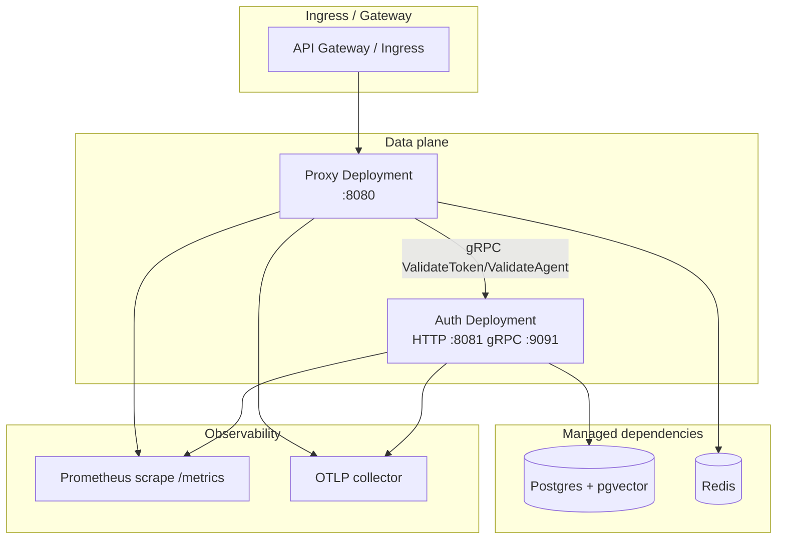

**Phase 1 status:** Kubernetes deployment artifacts are **not implemented**. There is no Helm chart, Kustomize overlay, or official manifest set in this repository yet. Local development uses [Docker Compose](/docs/deployment/docker-compose) for dependencies only; auth and proxy run as host processes or ad-hoc containers you build yourself.

<Callout type="experimental" title="Not available in Phase 1">
  Do not point production traffic at IBEX Harness until Phase 5 production-hardening milestones ship charts, runbooks, and SLO-backed rollouts. Track progress on the [roadmap](/roadmap/phase-5-production-hardening).
</Callout>

## What exists today

| Artifact | Phase 1 | Notes |
| --- | --- | --- |
| Helm / Kustomize manifests | No | Planned Phase 5 |
| Docker images for auth/proxy | No official publish | Build from `services/*/Dockerfile` when present |
| Compose dev stack | Yes | Data stores only — not a production topology |
| Health probe contract | Yes | [ADR-0022](/docs/adr/0022-health-check-contract) defines `/health` and `/ready` |
| mTLS between services | Documented | Required in production; plaintext on local `ibex_internal` network only |

## Target architecture (preview)

The production layout below is **design intent**, not shipped configuration. It shows how Phase 1 services are expected to fit into a cluster once manifests land.



## Planned probe configuration

When charts ship, operators should wire probes per [ADR-0022](/docs/adr/0022-health-check-contract):

<ProcessSteps
  steps={[
    {
      title: 'Liveness → GET /health',
      description:
        'Always 200 when the process responds. No external dependency checks. Restarts on hang/deadlock.',
    },
    {
      title: 'Readiness → GET /ready',
      description:
        '503 when critical dependencies fail. Auth checks Postgres SELECT 1; proxy checks auth gRPC and Redis PING.',
    },
    {
      title: 'Metrics → GET /metrics',
      description:
        'Prometheus text format from packages/metrics. Scrape both auth and proxy pods.',
    },
  ]}
/>

### Critical readiness checks (Phase 1)

| Service | Critical checks | Fails /ready when |
| --- | --- | --- |
| Auth | `postgres`, `grpc` | Postgres unreachable or gRPC listener down |
| Proxy | `auth_grpc`, `redis` | Auth unreachable or Redis PING fails |

Per-check timeout: **500ms**. Overall `/ready` budget: **750ms**.

## Environment injection (preview)

Production pods will receive the same variables documented in [Environment variables](/docs/deployment/environment-variables), injected via Kubernetes Secrets and ConfigMaps:

```yaml
# Illustrative only — not a committed manifest
apiVersion: v1
kind: Secret
metadata:
  name: ibex-auth
stringData:
  POSTGRES_DSN: postgres://…
---
apiVersion: v1
kind: ConfigMap
metadata:
  name: ibex-proxy
data:
  IBEX_AUTH_GRPC_ADDR: auth.ibex.svc.cluster.local:9091
  IBEX_PORT: "8080"
  IBEX_AUTH_VALIDATE_TIMEOUT: 50ms
```

<Callout type="note" title="Multi-tenant security">
  `org_id` always comes from verified tokens — never from ingress path rewriting alone. Cross-tenant resource access returns **403**, not **404**. See [Multi-tenant RLS](/docs/auth/multi-tenant-rls).
</Callout>

## Rollout expectations (future)

Phase 5 milestones will add:

- Separate Deployments for proxy and auth with HPA on CPU and request latency
- NetworkPolicy restricting gRPC to the internal mesh
- PodDisruptionBudgets and coordinated shutdown via `IBEX_SHUTDOWN_TIMEOUT`
- External Secrets Operator integration for `POSTGRES_DSN` and `REDIS_URL`

Until then, use Compose + host-run services for integration testing and refer to `web/engineering/OPS_GUIDE.md` in the repository for operational runbooks as they mature.

## Related

- [Proxy health](/docs/api-reference/proxy-health) — probe response schemas
- [Docker Compose](/docs/deployment/docker-compose) — supported local path today
