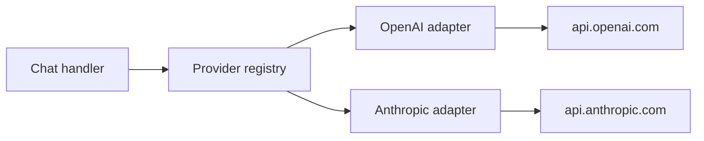

Provider adapters translate normalized IBEX chat requests into upstream LLM API calls and stream responses back to clients. Phase 1 validates and authenticates requests only — no adapter is registered at runtime, so every valid chat request stops with `501 PROVIDER_NOT_CONFIGURED`.

<Callout type="info" title="Phase 2 progress">
  Milestones [2.1.1](/roadmap/phase-2-single-provider/milestones/2.1.1-provider-interface-and-registry) and [2.1.2](/roadmap/phase-2-single-provider/milestones/2.1.2-openai-non-streaming-client) ship `packages/provider` and the OpenAI non-streaming adapter per [ADR-0025](/docs/adr/0025-llm-provider-abstraction) and [ADR-0026](/docs/adr/0026-openai-client-design). Set `IBEX_LLM_MODE=live` and `OPENAI_API_KEY` to forward; default `mock` returns `501 PROVIDER_NOT_CONFIGURED`.
</Callout>

## Why adapters exist

IBEX Harness must support multiple LLM vendors without leaking provider specifics into middleware. Adapters isolate:

- Upstream URL and authentication (API keys, Azure deployment IDs)
- Request/response dialect differences (tool calls, streaming chunk format)
- Retry and circuit-breaker policy per provider

The proxy critical path stays provider-agnostic: normalize once, delegate to the registry, stream the response. Target overhead remains under 20ms p99 excluding upstream LLM latency — see [Architecture overview](/docs/architecture/overview).



## Planned adapter contract

<ProcessSteps
  steps={[
    {
      title: 'Register at startup',
      description:
        'Each adapter registers a name, supported model prefixes, and a Forward function with the proxy registry.',
    },
    {
      title: 'Receive normalized payload',
      description:
        'Input is the validated OpenAI chat JSON plus org_id, agent_id, and request_id from middleware context.',
    },
    {
      title: 'Call upstream',
      description:
        'Adapter applies provider credentials from org-scoped configuration (never from the client request body).',
    },
    {
      title: 'Stream response',
      description:
        'Return OpenAI-compatible JSON or SSE chunks to the client; accumulate for async trace emission in later phases.',
    },
  ]}
/>

Adapters must not read `org_id` from the request body. Tenant context comes from verified auth middleware only — [Tenant isolation](/docs/security/tenant-isolation).

## Phase 1 behavior

Every authenticated, validated chat request hits the stub handler:

<CodeTabs>
  <CodeTab label="curl">
```bash
curl -s http://localhost:8080/v1/chat/completions \
  -H "Authorization: Bearer ${IBEX_DEV_TOKEN}" \
  -H "X-IBEX-Agent-ID: ${IBEX_DEV_AGENT_ID}" \
  -H "Content-Type: application/json" \
  -d '{"model":"gpt-4o","messages":[{"role":"user","content":"hi"}]}' \
  | jq '.error.code'
```
  </CodeTab>
  <CodeTab label="PowerShell">
```powershell
$headers = @{
  Authorization = "Bearer $env:IBEX_DEV_TOKEN"
  "Content-Type" = "application/json"
  "X-IBEX-Agent-ID" = $env:IBEX_DEV_AGENT_ID
}
$body = '{"model":"gpt-4o","messages":[{"role":"user","content":"hi"}]}'
(Invoke-RestMethod -Uri http://localhost:8080/v1/chat/completions -Method POST -Headers $headers -Body $body).error.code
```
  </CodeTab>
</CodeTabs>

Expected output: `"PROVIDER_NOT_CONFIGURED"`.

<Callout type="success" title="501 means success in Phase 1">
  HTTP 501 after validation confirms auth, agent verify, rate limiting, and normalization all passed. Use `make dev-smoke` to assert this automatically.
</Callout>

## Error envelope

```json
{
  "error": {
    "code": "PROVIDER_NOT_CONFIGURED",
    "message": "No LLM provider adapter is configured for this request",
    "request_id": "0192a3b4-c5d6-7890-abcd-ef1234567890",
    "timestamp": "2026-06-14T12:00:00Z"
  }
}
```

This is distinct from `503` dependency failures — the proxy itself is healthy; forwarding is simply not implemented yet.

## What Phase 2 adds

<Steps>
  <Step title="Registry">
    Model-to-adapter resolution with org-level overrides.
  </Step>
  <Step title="OpenAI adapter">
    First production adapter with streaming SSE support.
  </Step>
  <Step title="Circuit breaker">
    Provider 5xx triggers breaker; clients receive `503` with `Retry-After`.
  </Step>
  <Step title="Context injection">
    Parallel memory and directive retrieval before upstream call (later milestones).
  </Step>
</Steps>

Provider API keys will be stored per org in Postgres and injected by the adapter — never accepted from client headers. Rotation guidance: [Secrets and keys](/docs/security/secrets-and-keys).

## Security boundaries

| Control | Phase 1 | Phase 2+ |
| --- | --- | --- |
| Client supplies provider API key | N/A (no forward) | **Forbidden** |
| Org from token | Enforced | Enforced |
| Audit log per upstream call | No | Yes (ClickHouse traces) |
| PII in upstream prompts | Validated locally | Redaction pipeline |

## Verify adapter stub

```bash
make compose-dev-up
make db-migrate && make db-seed
make dev-smoke   # asserts 501 on chat without LLM key
```

Integration tests in `services/proxy/` assert `PROVIDER_NOT_CONFIGURED` for valid authenticated chat bodies.

## Related

- [Request routing](/docs/proxy/request-routing) — normalization before adapter handoff
- [Overview](/docs/proxy/overview) — middleware and failure modes
- [Architecture services](/docs/architecture/services) — proxy role in the system map
- [Roadmap Phase 2](/roadmap/phase-2-single-provider) — adapter delivery timeline
